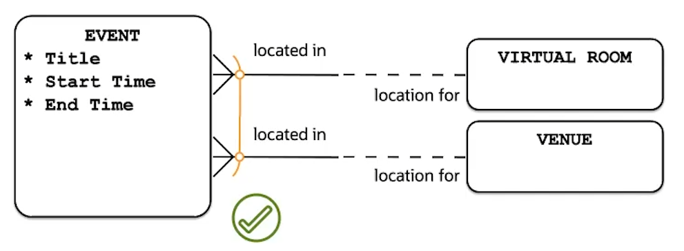
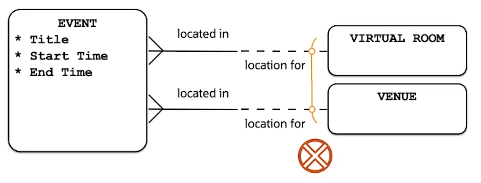

# Arc relationships

They are two or more mutually exclusive relationships of the same entity.

- Each instance of the _EVENT_ is either located in a _VIRTUAL ROM_ or in a _VENUE_

- Arc cannot be modeled on different entities

An arc allows models a business rule that states that relationships can be mandatory under specific mutually exclusive conditions. Without and arc, these relationships would have to be modeled as optional.

Joining relationships that are of different entities into an arc makes no sense. Also, an arc must have at least two relationships included and can have more.

Your company holds events in either a virtual room for online events or a venue for in-person events. It must be one or the other, cannot be both, and cannot be undefined. Events have a descriptive title, a time when they begin, and a time when they end. Both times are known at the time the event is created.
