# Chen Notation

## Entities

|               **Strong Entity**               |               **Weak Entity**               |                  **Associative Entity**                   |
| :-------------------------------------------: | :-----------------------------------------: | :-------------------------------------------------------: |
|  | 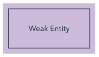 | 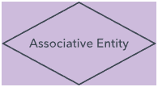 |

## Attributes

|                      **Simple**                       |                       **Derived**                       |                        **Multi-valued**                         |
| :---------------------------------------------------: | :-----------------------------------------------------: | :-------------------------------------------------------------: |
| 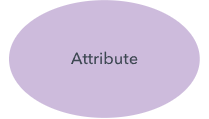 | 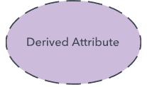 | 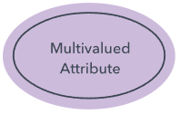 |

## Keys

|                 **Key Attribute**                  |                    **Partial Key Attribute**                    |
| :------------------------------------------------: | :-------------------------------------------------------------: |
|  | 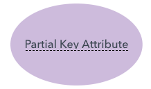 |

## Relationships

|                   **Strong Relationship**                   |                  **Weak Relationship**                  |
| :---------------------------------------------------------: | :-----------------------------------------------------: |
|  | 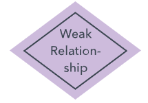 |

|                  **Example Weak Relationship**                  |
| :-------------------------------------------------------------: |
|  |

|                    **Partial Relationship**                     |                    **Total Relationship**                    |
| :-------------------------------------------------------------: | :----------------------------------------------------------: |
| 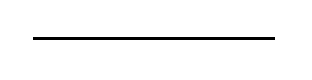 | 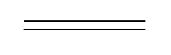 |

|                  **Example Total Relationship**                  |
| :--------------------------------------------------------------: |
|  |

|                 **One-to-one**                 |
| :--------------------------------------------: |
|  |

|                 **One-to-many**                  |
| :----------------------------------------------: |
|  |

|                  **Many-to-many**                  |
| :------------------------------------------------: |
|  |

|                **Recursive Relationship**                 |
| :-------------------------------------------------------: |
| 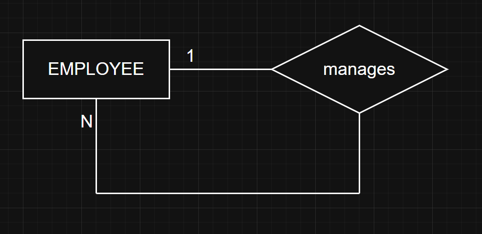 |

## Inherence

|           **Inherence Disjoint (exclusiva)**            |         **Inherence Overlapping (superpuesta)**         |
| :-----------------------------------------------------: | :-----------------------------------------------------: |
| 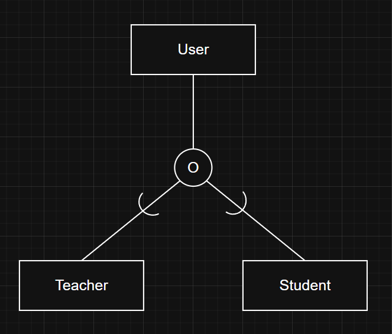 | 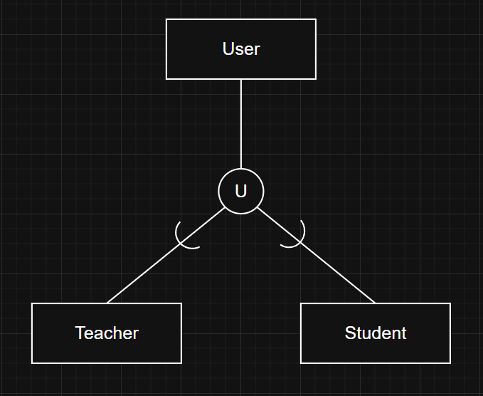 |

|                 **Total Participation**                  |
| :------------------------------------------------------: |
| 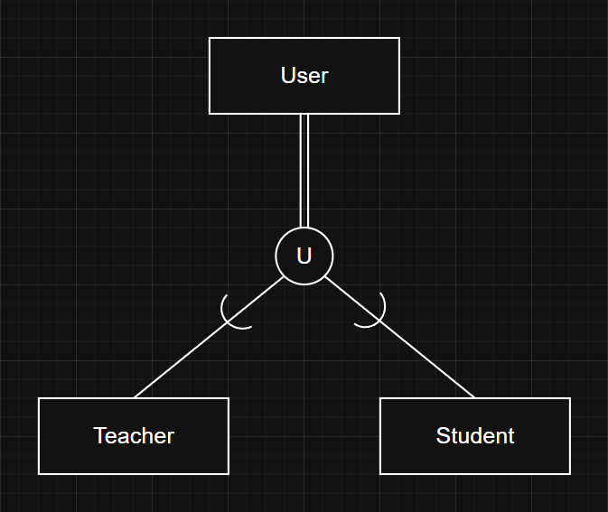 |
