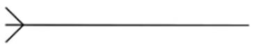
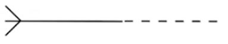
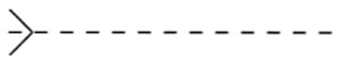
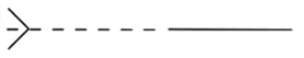
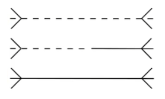
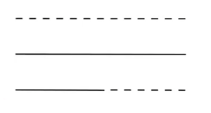

# Relationship types

## Many to One (One to Many)

### Composition (mandatory relationship)

A `M:1` mandatory relationship often indicates a composition nature of a relationship.

- Child depends on the parent for existence



- e.g.: an item that must belong to some order and that the order must be composed of one or more items

#### Example

- Table DEMOS

```sql
CREATE TABLE DEMOS (
  ID INTEGER NOT NULL PRIMARY KEY,
  COURSE_ID INTEGER NOT NULL, -- Mandatory composition

  CONSTRAINT DEMO_COURSES_FK FOREIGN KEY (COURSE_ID)
    REFERENCES COURSES (ID)
)
```

- Table COURSES

```sql
CREATE TABLE COURSES (
  ID INTEGER NOT NULL PRIMARY KEY
)
```

### Association (mandatory to optional relationship)

A `M:1` mandatory to optional relationship often indicates that a relationship is a simple association.

- Child can exist without the parent (foreign key can be `NULL`)



- e.g.: an item that must reference a product and a product that may be used by one or more items

#### Example

- Table DEPARTMENTS

```sql
CREATE TABLE DEPARTMENTS (
  ID INTEGER NOT NULL PRIMARY KEY
)
```

- Table EMPLOYEES

```sql
CREATE TABLE EMPLOYEES (
  ID INTEGER NOT NULL PRIMARY KEY,
  DEPARTMENT_ID INTEGER, -- Optional association reference to Departments

  CONSTRAINT DEP_EMP_FK FOREIGN KEY (DEPARTMENT_ID)
    REFERENCES DEPARTMENTS (ID)
)
```

### Optional reference

A `M:1` optional relationship often indicates that a relationship is an optional reference.

- relationship between child and parent is minimal, and the child is almost entirely independent



- e.g.: an image that may be used by a product and a product that may reference one or more images

#### Example

- Table SUPPLIERS

```sql
CREATE TABLE SUPPLIERS (
    ID NUMBER PRIMARY KEY,
);
```

- Table PRODUCTS

```sql
CREATE TABLE PRODUCTS (
    PRODUCT_ID NUMBER PRIMARY KEY,
    SUPPLIER_ID NUMBER, -- Completely optional
    CONSTRAINT SUP_PROD_FK FOREIGN KEY (SUPPLIER_ID)
        REFERENCES SUPPLIERS (ID)
        ON DELETE NO ACTION -- No impact on the child when the parent is deleted
);
```

### Optional inclusion (unusual)

A `M:1` optional to mandatory relationship often indicates that a relationship represents an optional inclusion.

- child may or may not reference the parent
- if the parent is missing, the child might use a default value or alternative logic



- e.g.: a product that may be included in some bundle and a bundle that must contain one or more products

```sql
CREATE TABLE ADVISORS (
    ID NUMBER PRIMARY KEY,
);
```

```sql
CREATE TABLE STUDENTS (
    STUDENT_ID NUMBER PRIMARY KEY,
    ADVISOR_ID NUMBER DEFAULT NULL, -- Optional inclusion
    CONSTRAINT ADV_STUD_FK FOREIGN KEY (ADVISOR_ID)
        REFERENCES ADVISORS (ID)
        ON DELETE SET NULL -- Optional relationship
);
```

## Many to Many

`M:M` relationship indicates a missing entity. Typical during early stages of analysis.

In later stages, these relationships should be resolved into intersection entities connected with `M:1` relationships.



- e.g.:
  - before an analyst has discovered an item entity, the relationship between _order_ and _product_ could be `M:M` mandatory to optional; that is, each _order_ must contain one or more _products_, and each _product_ may be included in one or more _orders_
  - later, this relationship should be resolved into the intermediate entity _item_ that has a composition relationship with the _order_ and an association relationship with the _product_

## One to One

`1:1` relationships indicate that a pair of entities could be the same entity or different stages in the entity life cycle.



- e.g.:
  - an order may be shipped as one and only one parcel, and each parcel must contain exactly one order.
  - in this case, _parcel_ seems to be a stage in the order life cycle or even a synonym for the _order_
  - upon closer examintaion of the business rule, you may find that a `1:1` relationship should in fact be a `M:1` relationship (for example, if more than one _order_ can be shipped together in the same _parcel_)
