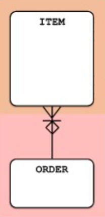

# Master-Detail Pattern

Master-detail constructions are very common as _1:M_ relationships.

Distinguish between a _1:M_ relationship that is typically directed from 1 to many and a relationship that is directed the other way around.

- Master-detail is characterized by the fact that the master, in this example _Order_, is divided into _Items_

- Items do not exist alone; they are always in the context of a specific _Order_

It is very rare that these relationships are transferable. If and instance of _Item_ is connected to the wrong instance of _Order_, it is far more likely that the instance of _Item_ is deleted and then re-created in the context of the correct _Order_

### Typical master-detail relationship names:

- Consists of
- Divided into
- Made of
- (Exists) With

## Example



### ORDER-ITEM

#### Master Table: Order

```sql
CREATE TABLE Order (
    OrderID INT PRIMARY KEY,
    OrderDate DATE NOT NULL,
    CustomerID INT NOT NULL,
    TotalAmount DECIMAL(10, 2)
);
```

#### Detail Table: Item

```sql
CREATE TABLE Item (
    ItemID INT PRIMARY KEY,
    OrderID INT NOT NULL,
    ProductID INT NOT NULL,
    Quantity INT NOT NULL,
    UnitPrice DECIMAL(10, 2) NOT NULL,
    FOREIGN KEY (OrderID) REFERENCES Order(OrderID)
);
```
