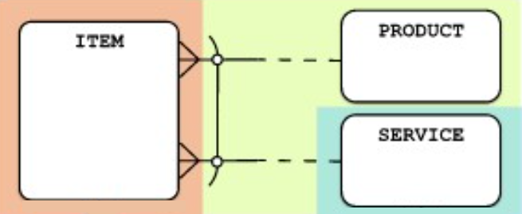

# Basket Pattern

A basket construction is a special case of a master-details pattern. A basket can contain one or more things, but these (often named _Items_) can be of different types. A single _Item_ is always of one type only.

That is the reason for the arc. The arc shows that an _Item_, must be of one and only of the types.

# Example

## ITEM-PRODUCT or SERVICE



### Events Table

Holds general attributes for all events.

```sql
CREATE TABLE Events (
    EventID INT PRIMARY KEY AUTO_INCREMENT,
    EventName VARCHAR(100) NOT NULL,
    EventType ENUM('ONLINE', 'OFFLINE') NOT NULL, -- Distinguishes event type
    EventDate DATE NOT NULL,
    CreatedAt TIMESTAMP DEFAULT CURRENT_TIMESTAMP
);
```

### OnlineEvents Table

Holds attributes specific to online events.

```sql
CREATE TABLE OnlineEvents (
OnlineEventID INT PRIMARY KEY AUTO_INCREMENT,
EventID INT NOT NULL,
Platform VARCHAR(100) NOT NULL, -- e.g., Zoom, Teams
MeetingLink TEXT NOT NULL,
AccessCode VARCHAR(50), -- Optional access code
FOREIGN KEY (EventID) REFERENCES Events(EventID)
);
```

### OfflineEvents Table

Holds attributes specific to offline events.

```sql
CREATE TABLE OfflineEvents (
OfflineEventID INT PRIMARY KEY AUTO_INCREMENT,
EventID INT NOT NULL,
VenueName VARCHAR(100) NOT NULL,
Address TEXT NOT NULL,
City VARCHAR(50) NOT NULL,
FOREIGN KEY (EventID) REFERENCES Events(EventID)
);
```
