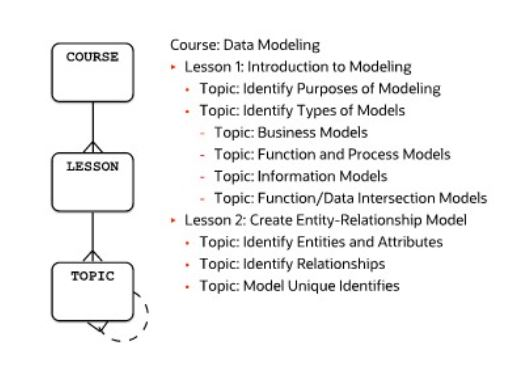

# Hierarchy Pattern

This pattern is used to model hierarchical or tree-like structures where entities are related in a parent-child relationship.

Hierarchical structures may have a kwnon limit for the maximum number of levels, for example, three levels for the course, lesson, ant topic. However, if a flexible depth is required, then a recursive relationship can be used to indicate this, as is the case with a topic that may include other topics.

Often, structures should be hierarchical, but you cannot be sure. Sometimes, they seem hierarchical but actually are not so. You can have, for example, the _"is owner of"_ relationship between companies. Suppose company C1 owns company C2 and company C2 owns company C3. Could it be that company C3 owns shares of company C1? Even

## Key Concepts

- _Parent-Child Relationship_:
  - Each record can be a parent to multiple child records
- _Self-Referencing Table_:
  - A table references itself to establish the hierarchy

## Example



```sql
   CREATE TABLE Hierarchy (
   NodeID INT PRIMARY KEY AUTO_INCREMENT,
   NodeName VARCHAR(100) NOT NULL,
   ParentNodeID INT, -- NULL for root nodes
   FOREIGN KEY (ParentNodeID) REFERENCES Hierarchy(NodeID)
   );
```
