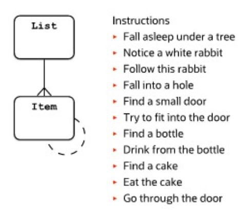

# Chain Pattern

Chain can be considered somewhat similar to a simple single-level hierarchy where elements have a certain order, such as a sequential set of instructions.

A chain (of beads) can be regarded as a special kind of hierarchy. A chain is a recursive relationship of an entity. The relationship of the chain is a `1:1` relationship as a chain is characterized by the fact that an object in the chain is preceded and followed by one object at most.

A chain is a structure where sequence is of importance (for example, the sequence of the pages in a chapter and of the chapters in a document, of the critical path in a procedure, or of the preferred road from A to B).

A chain can also be modeled as a master-detail. The recursive model allows an easy insertion in the chain.

## Example



Table with Next Reference

```sql
CREATE TABLE Chain (
   NodeID INT PRIMARY KEY AUTO_INCREMENT,
   NodeName VARCHAR(100) NOT NULL,
   NextNodeID INT, -- NULL for the last node
   FOREIGN KEY (NextNodeID) REFERENCES Chain(NodeID)
);
```
