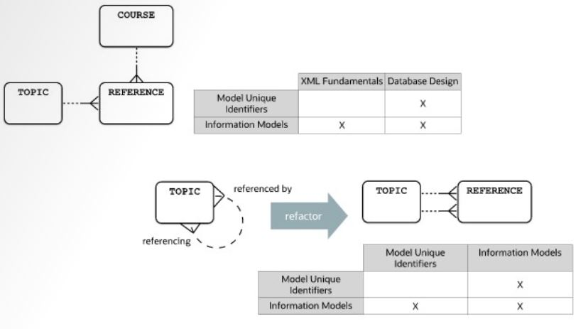

# Matrix and Network pattern

Network structures typically describe pairs of things of the same type, for example, marriage, railroad track (pair of start and end stations), synonyms (two words with the same meaning), and web documents with hyperlinks to other web documents.

- The `M:M` relationship must be resolved to hold specific information about the pair, such as the date of the marriage or the length of the railroad track
- The two relationship of the intersection entity form the unique identifier

## Example

