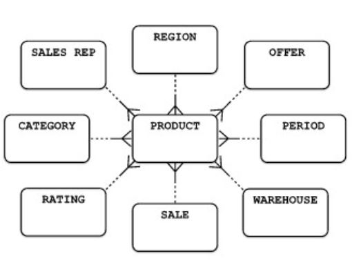

# Snowflake pattern

A data warehouse system can be modeled as any sistem. Data warehouses contain the same sort of information as any straightforward transaction processsing information system.

Data warehouses usually contain less detailed, summarized information as warehouses are mainly built for overview and statistical analysis. However, data warehouses in general receive input from online transaction systems that do contain details.

Data warehouses often have a star-shaped model. This is made up of one central entity (_the facts_) containing condensed, summarized information and several dimensions that classify and group the details.

Common dimensions represent entities such as:

- Time
- Geography
- Actor (for example, salesperson, patient, customer, instructor)
- Product (for example, article, medical treatment, course)

Often, the dimensions are classified as well. Time may be structured in day, week, month, quarter, or year. You can classify products in various ways. If this is the case, the model is usually described as the Swownflake model, as it looks like the crystal shape of a snowflake.

## Example

