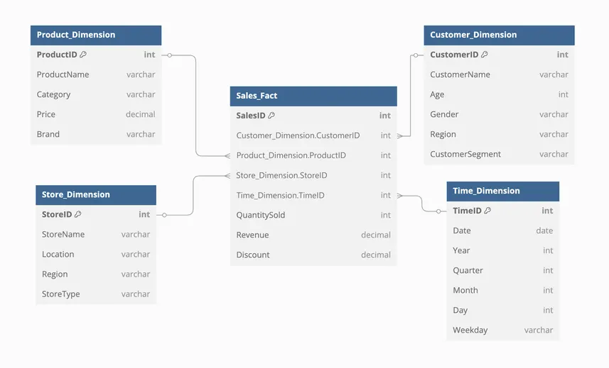

# Dimensions

Descriptive attributes (dimensions) that provide context to the fact table.

Using dimensions tables brings many benefits

### Avoid data duplication and reduce storage

- instead of repeating descriptive attributes (like customer name, product name, category) in every row of the fact table
- we store them once in a dimension table
- fact table only store small surrogate keys, reducing data size

### Flexibility for adding or changing attributes

- adding new attributes to a dimension (e.g., customer segment, loyalty level), only needs to update the dimension table, not the fact table
- fact table remains small and stable, only focused on measures

### Simplifies reporting & queries

- reporting tools and BI platforms can easily join fact and dimension tables by surrogate keys

- users can create dynamic reports, aggregations, and drill-downs using dimension attributes

### Supports Slowly Changing Dimensions (SCD)

- support historical changes (e.g., customer's address change)
- applying SCD techniques without impacting the fact table

Example: Type 2 (new row for each change), Type 3 (add previous value in a column).

### Cleaner star schema structure

- Clear separation of concerns:
  - Fact table: What happened? (measures)
  - Dimension table: Who, when, where, how (context)

## Attributes

Descriptive details of a dimension.

- enable slicing and dicing of data from different perspectives
- product category, customer age group, region, date month

## Hierarchies

Logical structures of levels in dimensions that allow data aggregation at different granularities.

- support roll-up and drill-down analysis
- support multi-level aggregations

| Level 1          | Level 2             | Level 3      |
| ---------------- | ------------------- | ------------ |
| Product Category | Product Subcategory | Product Name |

### Benefits

- Stability
  - surrogate keys stay the same even if business keys (like CustomerID) changes
- Handles History
  - Support for Slowly Changing Dimensions (Type 2)
  - allows storing multiple records for the same entity, each with a unique surrogate key
  - allows the dimension to store multiple records for the same business entity, with different surrogate keys for each version
- Performance:
  - faster joins using integer surrogate keys instead of long business key
- Independence from Source Systems
  - data warehouse manages its own keys
  - avoiding problems if source system keys change
- Integration Multiple Systems
  - allows assigning one surrogate key to the same entity from different systems

## Example

- Fact Table: each row represents a sale
- Dimesions Table:
  - Product_Dimension: describe products
  - Store_Dimension: describe stores
  - Customer_Dimension: describe customer
  - Time_Dimension: describe date of the sale

