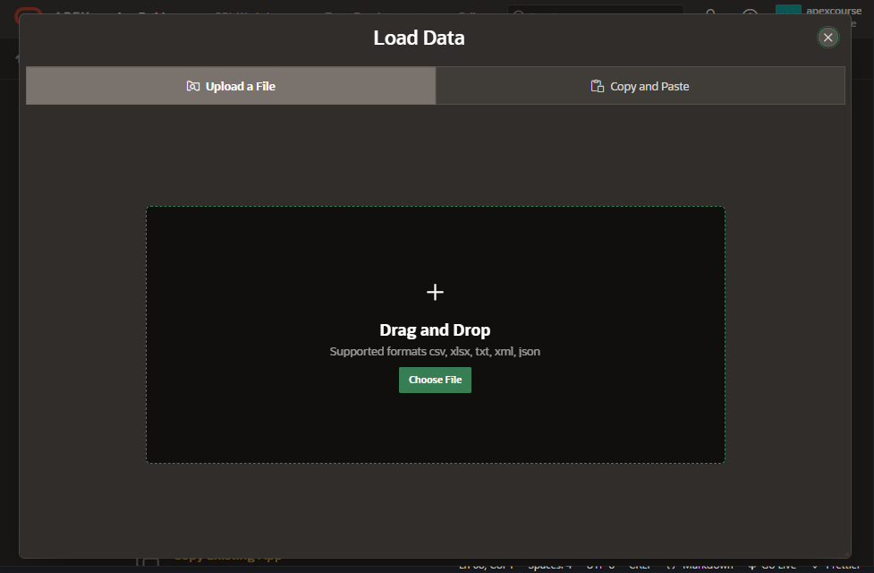
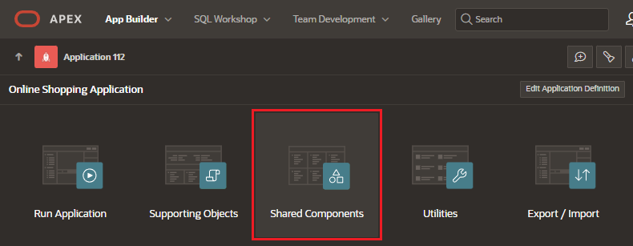

# App Builder

App Builder enables you to design, develop, and deploy applications which are beautiful and responsive.

The home page displays all installed applications in the current APEX instance.

## Access to App Builder

To access the App Builder

## Functionalities

App Builder offers the following functionalities:

- Create new applications
- Import previously exported applications
- Dashboard
- Workspace Utilities
- Edit and View already created applications

## Create application

When creating an application we have the following possibilities:

### Use Create App Wizard

Select the option "Use Create App Wizard"

First enter the basis informacion:

- icon app
- name for application
- appearence

Create the pages for the application

Add features for your application

Fill the settings:

- Application ID
- Schema
- Authentication
- Language
- Advance settings
- UI Defaults

Alternately, you can load a blueprint to use the structure of another application

### Create App From a file

Select the option "Use Create From File"

Select the file from your local system and click on upload

### Browse Apps in Gallery

Select the option "Browse Apps In Gallery"

Select and install a sample application from the list

You can check the Oracle sample applications in Github
https://github.com/oracle/apex

### Others options

- Create App From Quick SQL

- Copy Existing App

## Application Builder Editor

Open an existing application to start editing the content

### Main Functionalities (Top bar)

- Run application
- Supporting Objects
- Shared Components

Select an shared component to install

- Utilities
- Export / Import
- Edit Application Definition

### Application Pages

List of all the pages of the applications

- Create Page
- Edit Page
- Remove Page
- Filter Pages

### Tasks Menu

Menu located on the right of the editor

- Delete application
- Copy application
- Add feature Page
