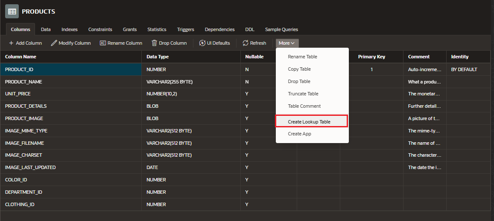

# Object Browser

Enables developers to browse, create, and edit objects in the database.

## Access to Object Browser

## Functionalities

- Follow simple wizards to create database objects
- Browse and modify table, views packages, procedures, and more
- Browse and filter data in your tables and views

## Layout

- Object Selection pane (left):

  - lists the database objects of a selected type within the current schema
    -filtering on the object name for further narrrow results

- Detail pane (right)
  - displays the detailed information about the selected object
  - to view object details, select an object in the Object Selection pane
  - click the tabs at the top of the Detail pane to view additional details about the current object

## Create Lookup Tables

### Access

- Go to a Table
- Click on "More" > Create Lookup Table

### Creation Form

- Select the colum and fill the name
- Click the "Create Lookup Table" button to create:
  - new look up table
  - the column have been remaned to `_id` and stores the reference to the new lookup table
