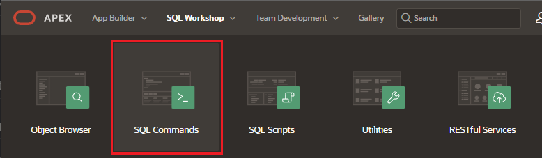
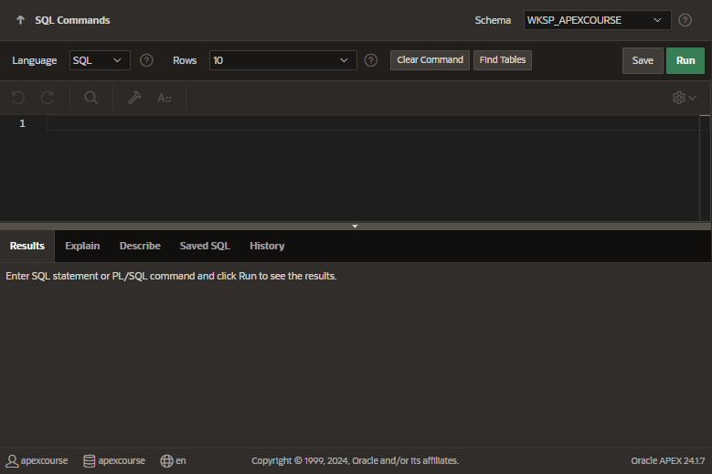

# SQL Commands

Create, edit, view, run, and delete database objects.

## Access to SQL Commands

## Functionalities

- Create, edit, view, run and delete database objects
- Export the results of the query to a spreadsheet
- Use Query Builder
- Access to SQL queries created in the SQL Builder

## Layout

- Command editor: to execute SQL commands
- Display pane: to view output saved command lists and history lists
