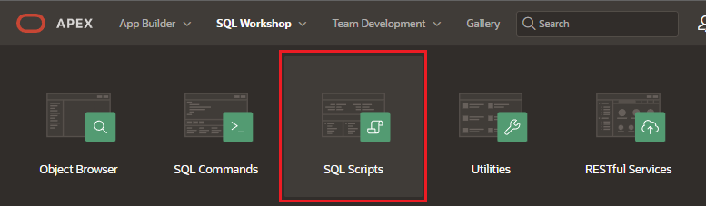
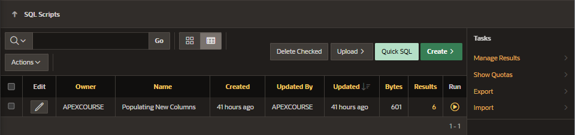

# SQL Scripts

A SQL script is a set of SQL commands saved as a file in SQL Scripts.

You use SQL Scripts to create, edit, view, run, and delete script files.

## Access to SQL Scripts

## Functionalities

- Create and execute SQL scripts
- Upload script from local file
- View run deatils of the scripts executions

## Layout

- Tool Bar with actions (top):

  - Delete Checked
  - Upload
  - Quick SQL
  - Create

- Scripts Table (bottom)
  - list of the SQL script created
