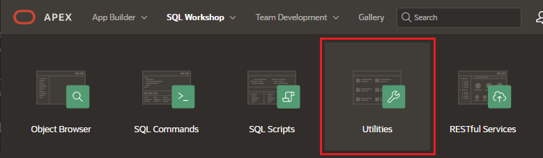
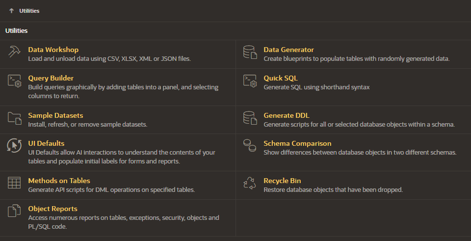
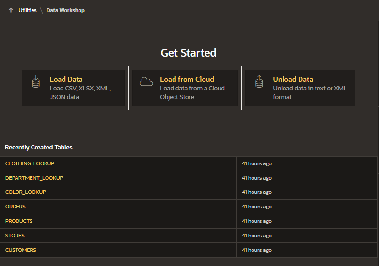
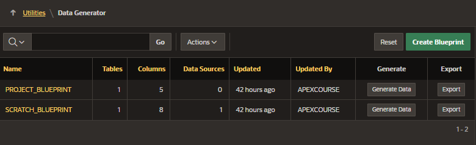
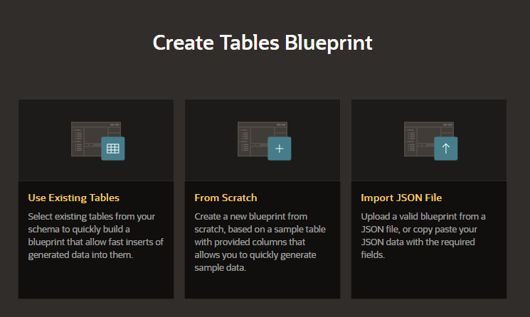
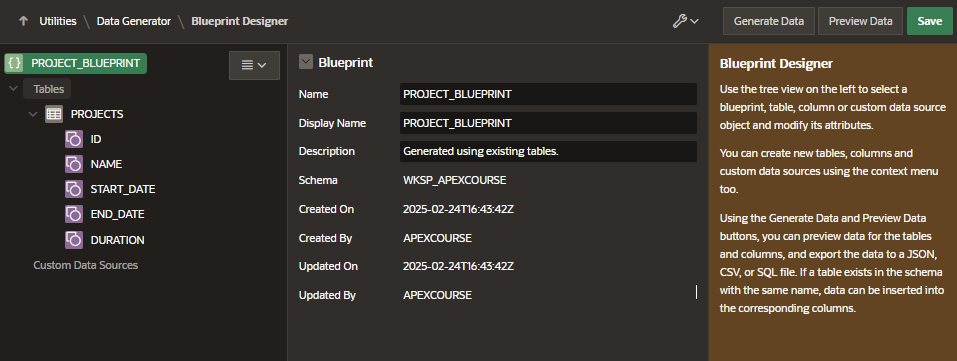
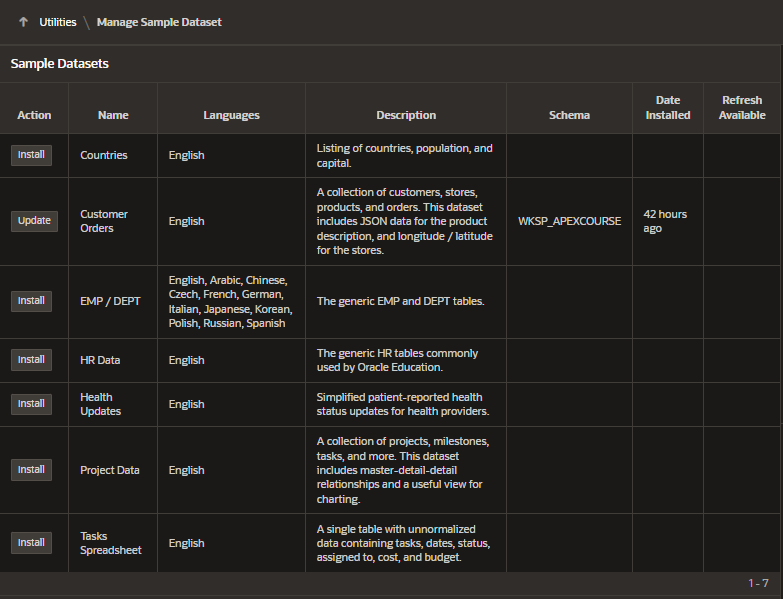

# Utilities

Provides utilities to build SQL queries, load and unload data from an Oracle database, generate DDL, view object reports, manage user interface defaults, restore dropped database objects, compare schemas, monitor the database, and view database details.

## Access to Utilities

## List of Utilities

- Data Workshop
- Data Generator
- Query Builder
- Quick SQL
- Sample Datasets
- Generate DDL
- UI Defaults
- Schema Comparison
- Methods on Tables
- Recycle Bin
- Object Reports

## Data Workshop

Use Data Workshop to load data into your workspace from:

- Load Data: from XLSX, CSV, XML, and JSON
- Load from Cloud: from a Cloud Object Store

Use the Unload Data Wizard to export your data in text or XML format

## Data Generator

Data generator is a utility in SQL Workshop to create blueprints and then generate sample data.

### Create Blueprints

- Using Existing Tables from your schema

  - enter a name for the blueprint
  - select the list of tables, the number of rows, etc

- From Scratch

  - Enter the necessary details, such as name and description
  - Check "add Starter Table" (enabled by default) to adds both a sample table populated with sample data and a custom data source object

- Import JSON File
  - upload a valid blueprint from a JSON file
  - copy paste your JSON data with the required fields

### Blueprint Designer

Allow you to create new tables, new columns or modify attributes

### Generate Data

You can generates sample data for the tables and columns

- Action: what to do with the generated data
  - File export:
    - JSON, CSV, SQL Insert
  - Insert into database:
    - insert into or Fast insert into
    - only available if the table with the same name exists in your schema
- Row Scaling: indicates the number of rows to insert

### Preview data

Before generating data you can preview some data and then generate the data.

## Sample Datasets

Enables you to easily build sample applications.

Each dataset includes sufficient data to build pages with various components.

Install de dataset you want to install

## SQL Developer Web

SQL Developer Web provides a web-based interface that enables you to execute queries and scripts, create database objects, load data, build data models, monitor database performance.

SQL Workshop > SQL Developer Web

### Requirements

The requirements for enabling the SQL Developer Web menu option are that:

- Oracle REST Data Services ORDS release 23.1.0 must be running in HTTPS mode
- An instance administrator must select the Enable SQL Developer Web attribute in administration services

### Configure

- Go to SQL Workshop > SQL Developer Web
- Select a Workspace Schema
- Register Schema with ORDS
- Choose default attributes and click on "Save the schema attributes"
- Go again to SQL Workshop > SQL Developer Web and this will open the SQL Developer Web in another browser window
