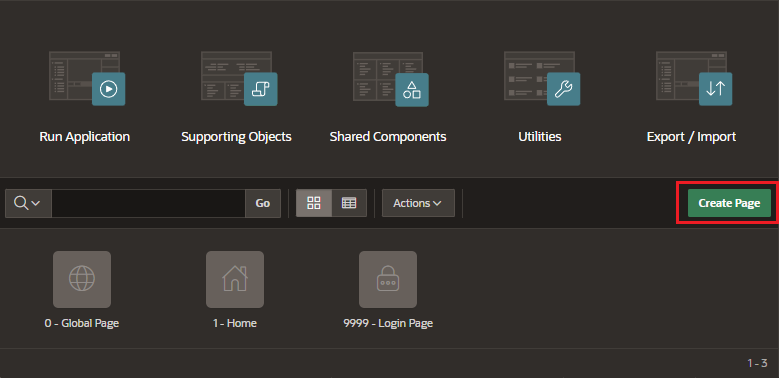
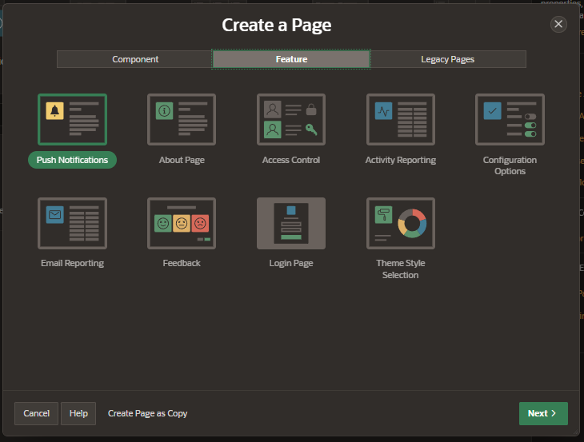
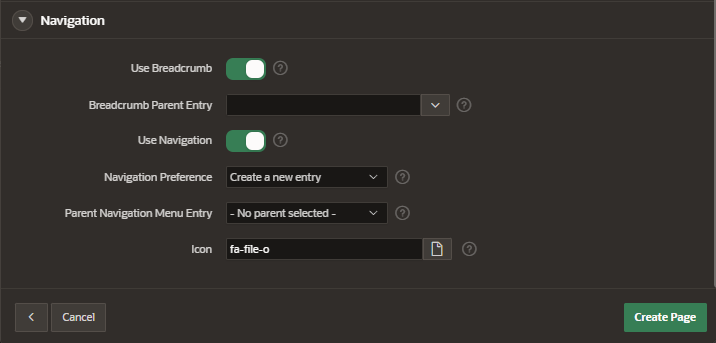

# Create Page

On your application home page, click on Create Page.

Or if you already have the Page Designer open, you can navigate to the Page Designer toolbar and click on the plus icon and select Page.

The Create Page Wizard includes three types of pages:

## Types of pages

### Components

- page-level functionalities
- multiple components in one application

### Features

- application-level functionalities
- typically on per application

### Legacy Pages

- are still supported
- but not recommended

## Page Definition

Once you select the type of page and click the button Next, you have to fill the Page Definition.

- Page Number
- Name
- Page Mode:
  - Normal
  - Modal Dialog
  - Drawer

## Page Navigation

Set the navigation configuration for the page

- Use Breadcrumb
- Breadcrum Parent Entry
- Use Navigation: allow users to navigate to a new page directly from the navigation menu
- Navigation Preference
- Parent Navigation Menu Entry
- Icon

And click on button "Create Page"
