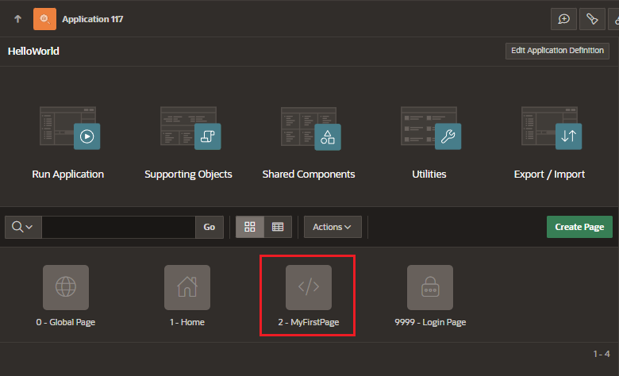
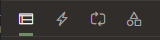
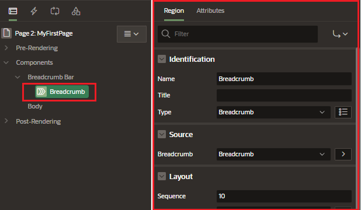
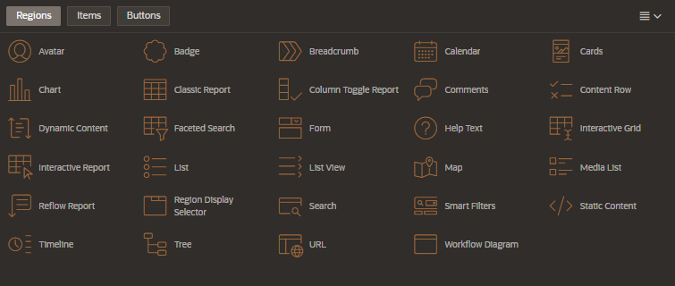
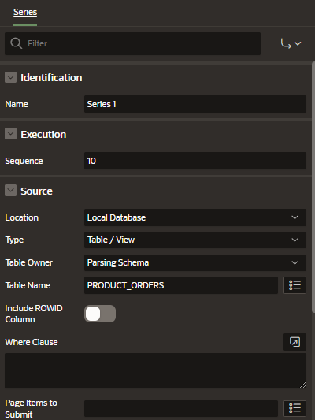
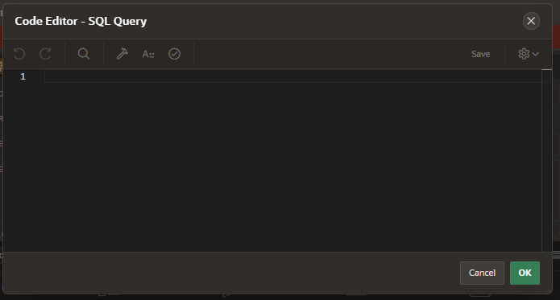

# Page Designer

Page Designer is a fully featured integrated development enviroment

## Access to the Page Designer

To acces to the Page Designer you need to select a page you want to edit

## Designer Toolbar

Toolbar located on the top of the Page Designer

- Page selector
- Lock/Unlock:
  - unlockable pages are editable
- Undo/Redo Buttons
- Create Menu:
  - Pages, regions, etc
- Utilities Menu:
  - Delete page
  - Advisor, caching, history, checksum, export
  - Show: Tooltips or Layout View
  - Change Layout
- Share Components
- Save
- Run: Save an rund

## Left Pane

The left pane include 4 tabs

### Rendering

Displays the regions, page items, page buttons, page components, and application logic.

- show contextual menus for component and control by right click
- quick access to the property editor
  - select a component or multiple components to display the corresponding attributes in the property editor in the right pane
- drag and drop to rearrenge components

### Dynamic actions

Displays the dynamic actions defined on this page.

You can create complex clients side behavior declaratively without the need for JavaScript

### Processing

Displays the application logic

### Shared Components

Displays the shared components associated

## Central Pane

The central pain in the page designer consists of five sections.

### Layout

Displays a visual representation of the page regions, items, and buttons that define a page.

- represent how components are positioned
- components can be delete, move or copy
- adjust size of components using the splitters

#### Gallery Pane

The Gallery Pane located at the bottom of the central pane show a list of components you can be added to the layout by drag and drop.

It contains 3 tabs:

- Regions
- Items
- Buttons

### Messages

Displays the errors and warning you need to address.

Clicking a message changes the focus within the property editor, the corresponding attribute associated with the error or warning.

### Page Search

Allows you to search for the page metadata, including regions, items, buttons, dynamic actions, columns, and so on.

### Help

Displays attribute specific help.

Click the attribute name within the property editor to view the information and examples.

## Right Pane

The right pane in the Page Designer contains the property editor.

- displays all attributes for the current component selected

- if multiple components are selected, the property editor only displays the common attributes

- attributes are organized into functional groups like identification, labels, settings

- to search for a group or an attribute, enter a keyword in the filter properties field.

#### Code Editor

For attributes requiring large amounts of code, for example, a region source, you can enter the code directly into the region or the item component settings using the code editor.

Click the code editor icon to enter text in a fully featured code editor.

You can use the code editor to edit attributes requiring a large amount of code.

The code editor provides an enhanced editor to edit PL/SQL, SQL, HTML, CSS, and JavaScript component properties.

