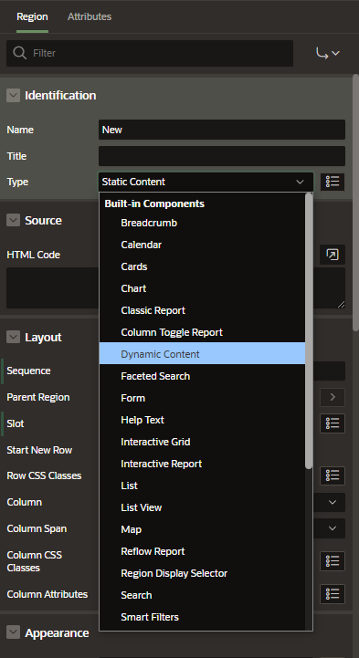
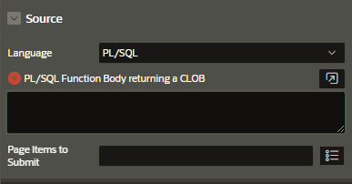
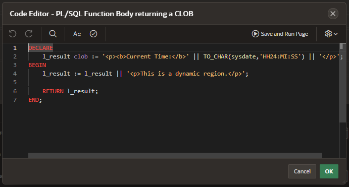

# Dynamic Content Region

Dynamic content region is based on PL/SQL that enables you to refresh the region dynamically.

The dynamic content region has an attribute called PL/SQL function body returning a CLOB. It displays any HTML value you return using this CLOB.

It is the developer's responsibility to ensure that the generated HTML is accessible and secure. Untrusted content should be escaped appropriately to avoid cross-site scripting.

This is similar to the PL/SQL dynamic content region we had earlier with a few differences:

- returns a HTML value as a CLOB instead of a HTTP package
- supports lazy loading
- region is refreshable
- support PL/SQL and Javascript (MLE)

## Example

Create a new Region and on the property editor select the Type as "Dynamic"

Automatically it will show an error that means that you have to provide a PL/SQL function body returning a CLOB.

Open the Code Editor and enter the PL/SQL function body

Now, if we run the application every time we click on the "Refresh" button the region will be updated
