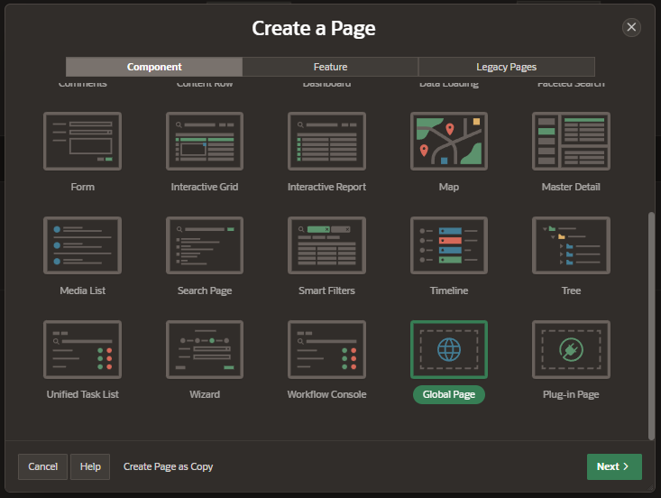

# Global Page

A global page, previously referred to as page `0`, functions as a master page, and whatever you add to this page will appear on every page in your application.

Oracle APEX engine will render all component added to the global page. However, you can control by defining conditions:

- what components to the render
- run a computation or validation

Note that you cannot run the global page directly from the Page Designer.

## Creating the global page

You can only create a global page for each application.

The Global Page option only appears if the application does not have a global page already.

