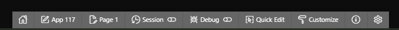
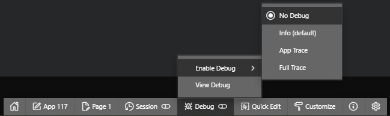
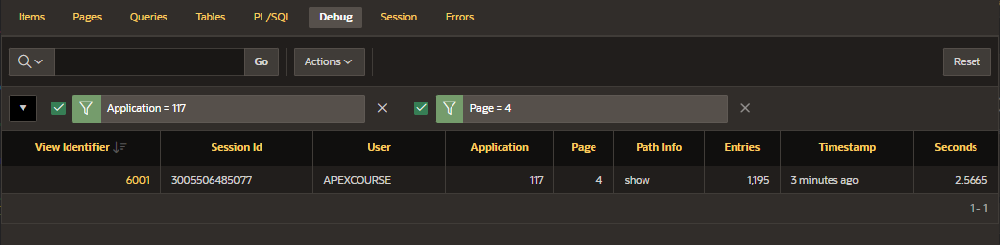
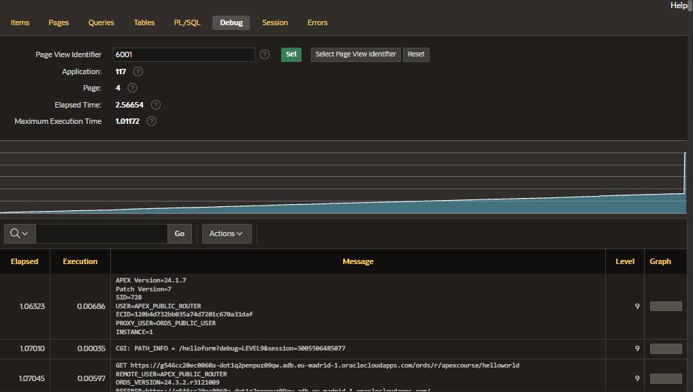
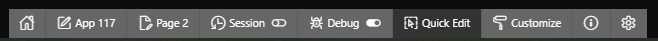
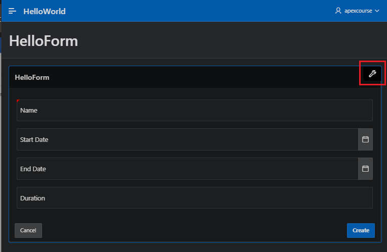
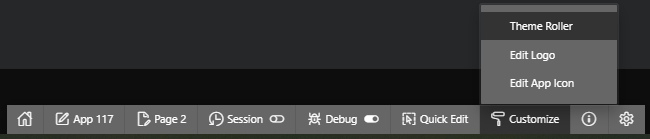

# Runtime Developer Toolbar

When you run an application from the App Builder and view a page, the Runtime Developer Toolbar displays at the bottom of any editable page.

You can use the Runtime Developer Toolbar to quickly edit the current application or currently running page or view the session state.

- navigate to workspace home page, or the application home page, or directly navigating to the Page Designer of the current running page
- view the session state
- enable and view the debug mode
- quickly edit and access live template options
- customize theme using the Theme Roller to quickly change the theme style, colors, and other attributes



## Debug Mode

You enable or disable debug mode for the current page and session by clicking the Debug on the Runtime Developer Toolbar.



If the debug mode is enabled, debug data is captured in the background.




You can also use the `f?p` syntax to run an application in debug mode.

To do so, simply call the page and set the debug argument to yes or level n, where n is between 1, which is least detailed, and 9 being most detailed.

```
https://apex.course.com/ords/r/apexcourse/helloworld/myfirstpage?debug=LEVEL9&session=3005506485077
```

## Quick Edit

You can also modify the template options, live by clicking on the Quick Edit.


- move the mouse over the component for which you want to modify the template options
- you get a wrench icon in the upper right corner
- clicking the wrench icon will open a wizard for you to modify the template options without going to the Page Designer



## Customize


