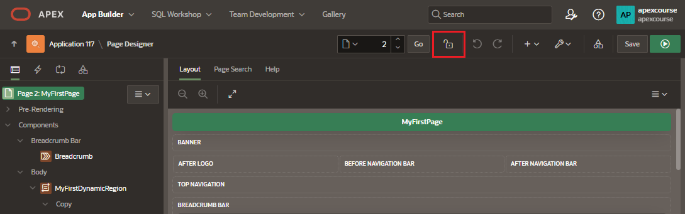
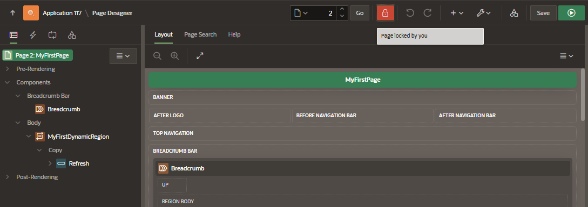
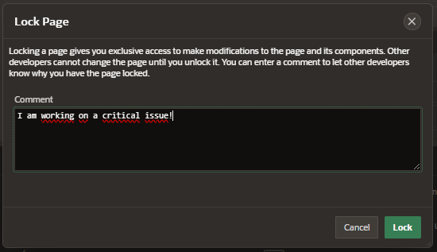
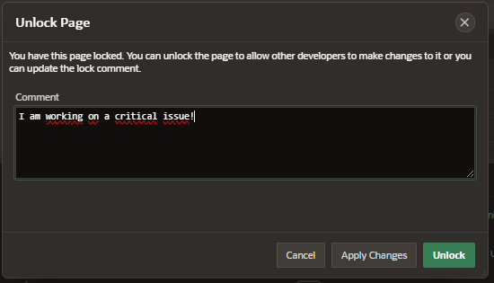
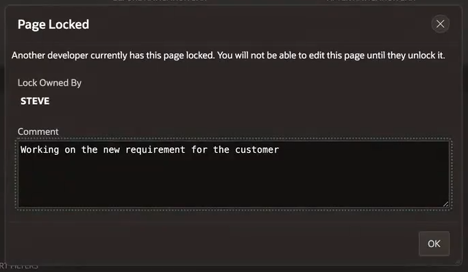

# Lock/Unlock pages

A lock icon in the toolbar indicates whether a page is currently locked. If a page is unlocked, the icon appears as an open padlock. If the page is locked, the icon appears as a locked padlock.

Passing your cursor over a locked page button displays a tooltip that indicates who has locked the page.

## Lock Page

By locking a page, you can prevent conflicts during application development among developers

Pages can be lock in the following locations:

- application home page
- page Locks page
- Page Designer

When you lock a page enter a comment to show why you have lock the page

## Unlock Page

Only the developer who locks a page can unlock that particular page.

However, if you are an admin, you can unlock pages locked by other developers.

If another developer has locked the page you cannot unlock it.

