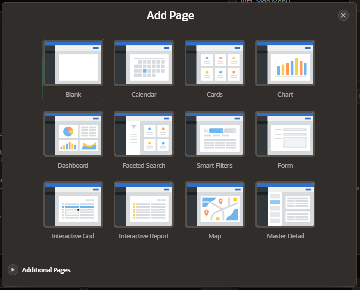
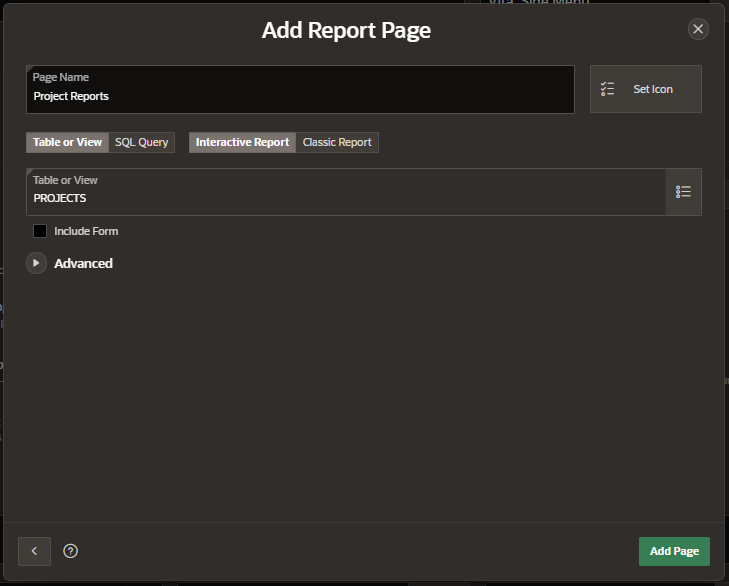
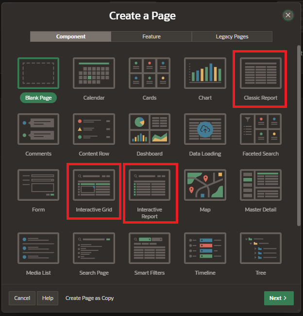
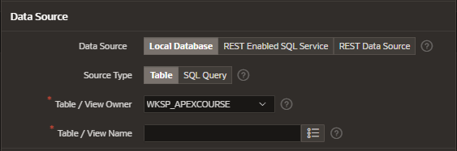
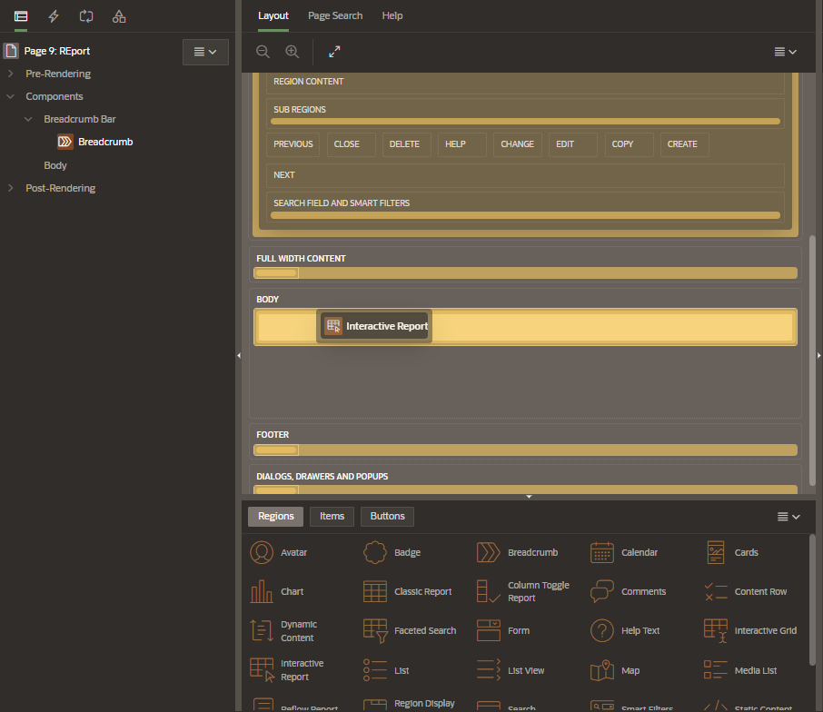
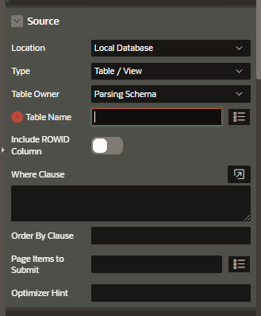

# Reports

- Interactive Reports
  - end user can customize how and what data is display
- Interactive Grid
  - end user can customize how and what data is display
  - end user can add, modify, and refresh data directly on the report
  - end user can rearrange the report interactively using the mouse
- Classic Report

## Creating Reports

### Create a report when you create a new database application

Enter the page details:

- name, icon
- type:
  - interactive report
  - classic report
- source;
  - table of View
  - SQL Query
- include form: to allow user to mantain the data

### Create a report as a new page in an application

In the Add Page Dialog, select a report

And enter the source information for the report

- Data Source
  - local database
  - rest enabled SQL Service
  - REST data source
- Source Type
  - table
  - SQL Query

### Create a report region on a page in an application

- In the Gallery menu, under Regions tab, select Interactive Report
- Click and hold the mouse and drag it to the desired location in the Layout tab

You need to select a source table name for the Interactive Report region.

