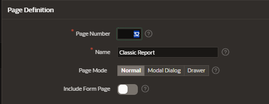
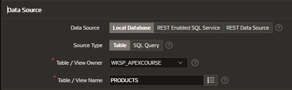

# Classic Report

A classic report is the formatted result of a SQL query.

## Functionalities

With the exception of sorting and simple filtering, and users cannot customize
a classic report.

## Creation

Create a new page and select the component Interactive Report

### Page Definition

Enter the interactive report details

### Data Source

Enter the data source information

Data source:

- loca database
- REST enabled SQL Service
- REST data source

- Source Type:

  - Table
  - SQL statement

- Table / View Owner
- Table / View Name

## Attributes

### Appearance

- Template Type:
  - Predefined: prevents from rendering and exports the report in CSV, XML, HTML
  - Theme: use Universal theme
- Template: universal theme provides various report templates
  - Alerts
  - Badget list
  - Cards
  - Content Row
  - so on

### Pagination

- Type
- Display Position
- Partial Page Refresh

### Break Formatting

Control if a specific column repeats and how column breaks appear when printed

## Edit Headers Layout

Selecting each column and editting their properties we can alter their layout

### Heading

- Heading: edit the text
- Aligment

### Layout

- Sequence
- Column aligment

### Sorting

- Default Sequence
- Direction
- Sortable

### Advanced

- Cell width
- Compute sum: specify whether the sum is computed and displays at the end of the report

## Create Column Link

To create a link in a column, specify the type as Link

- Select column
- Properties > Identification > Type
- Enter Linkt Target

## Create Download Link

To create a download link go to

- Properties > Download
  - CSV Export: enabled
