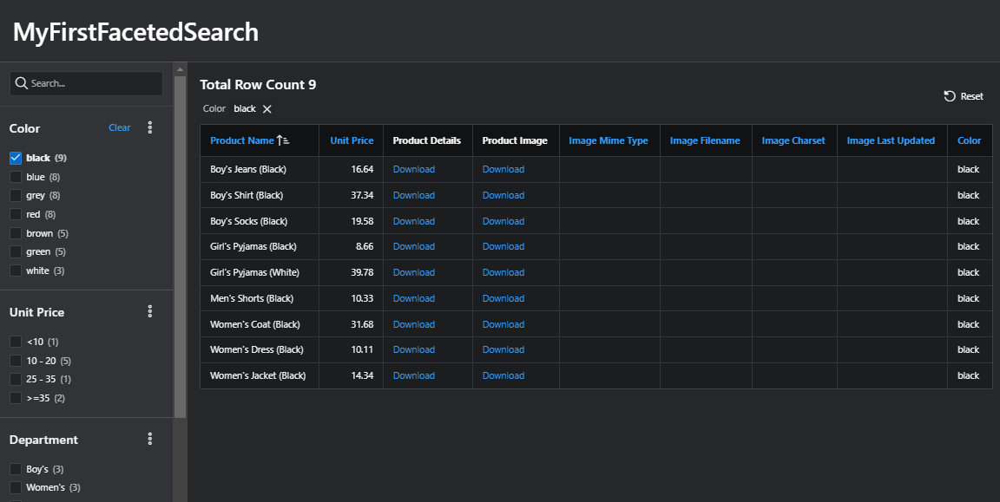
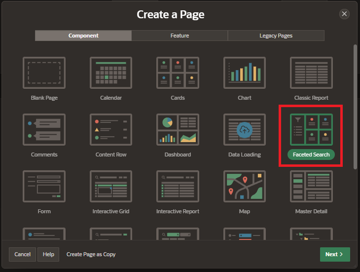
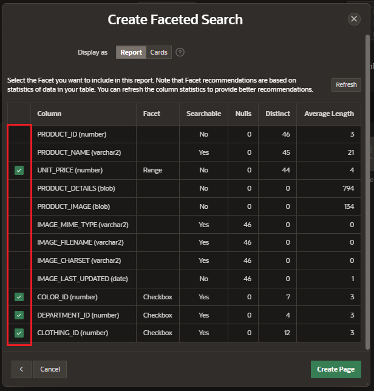
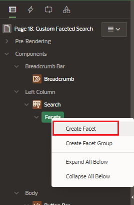
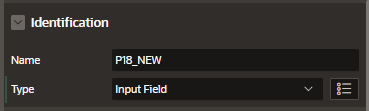
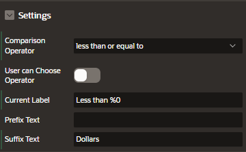
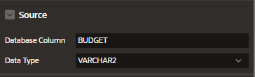
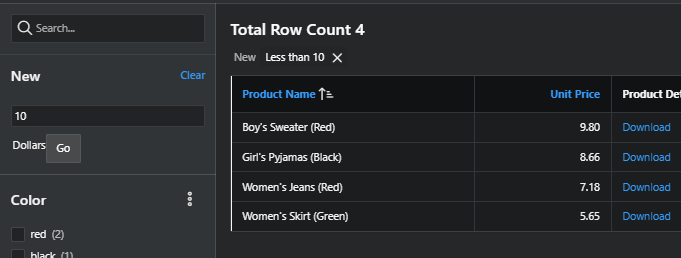
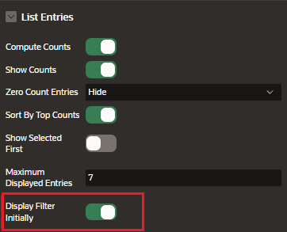

# Faceted Search

The end user can set filters using facets on the left or upper side of the screen. A facet shows possible values together with the occurrence count within the result set.

When an end user changes a facet, the results, the dependent facet, and the occurrence counts refresh immediately.

## Creation

Create a new page and select

Enter the page information

- Page Definition
- Data Source
- Navigation Preferences

Select the facets you want to include in the report

Automatically, some Facet will be recommended to be selected based on the data of the table. You can refresh the column statistics to provide better recommendations.

## Attributes

### Settings

- Batch Facet Changes
- Compact Numbers Threshold
- Show Current Facets
- Current Facets Selector
- Show Total Row Count: specify where to display the total row coun
- Total Row Count Label
- Show Charts
- Display Charts for Top N Values

## Customize Faceted Search

### Create a new Facet

New Facet can be created for our page

Enter the settings attributes to customize the new facet

For example, this facet will filter Budget less than the input value

- Name
- Type
  - Checkbox Group
  - Input Field
  - Radio Group
  - Range
  - Search
  - Select List

The result of the new facet

### Enable Facet Filtering

We can enable filtering for a specific facet

### Create dependent Facets

We can associate facets so they depend on another facet

