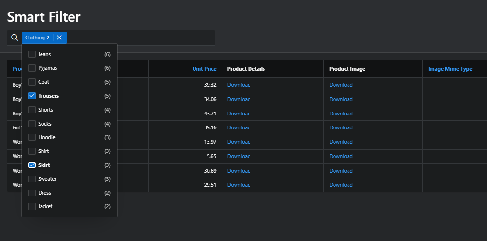
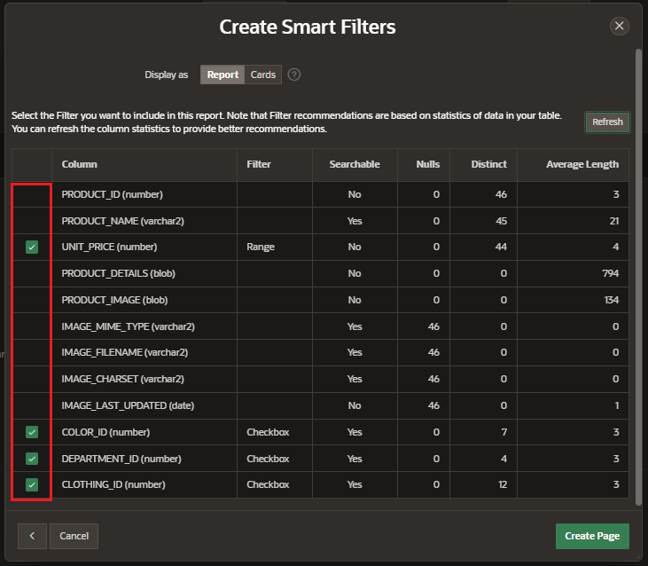
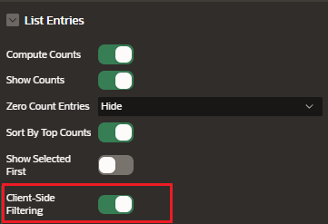

# Smart Filter

The Smart Filter page features a single search field with filters at the top of the page and a report at the bottom.

Each filter is displayed as a suggestion chip with a single count of how often the specific suggestion value occurs.

## Creation Page

You can create a smart filters page:

- Create Application Wizard
- Create Page Wizard
- Add a smart filters region to an existing report in the Page Designer

Select the filters you want to include in the report

Automatically, some filters will be recommended to be selected based on the data of the table. You can refresh the column statistics to provide better recommendations.

## Create New Filter

If we want to add an additional filter, go to Filters and "Create Filter"

Set the attributes

- Identification
  - Name
  - Type
- List of Values
- Source
  - Database column
  - Data Type

### Enable Filtering in Smart Filter

We can enable text filtering for a specific filter

