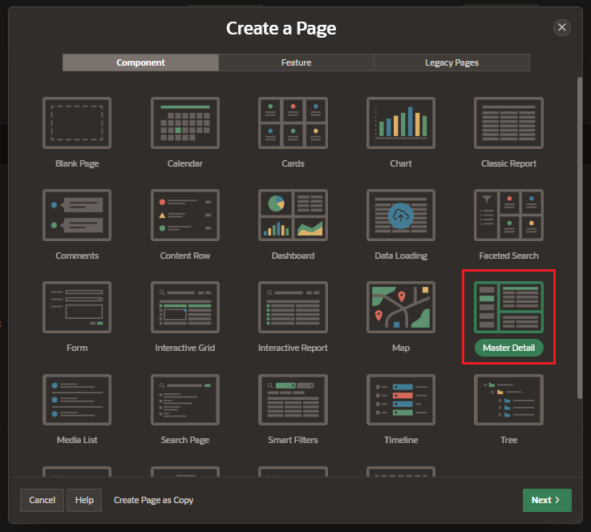
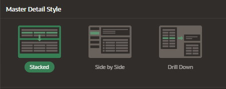
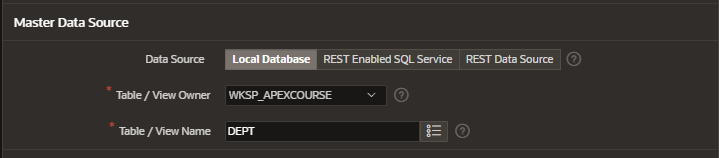
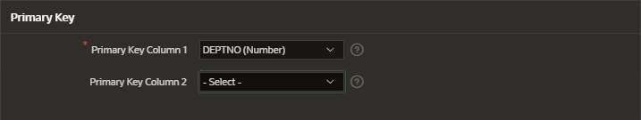
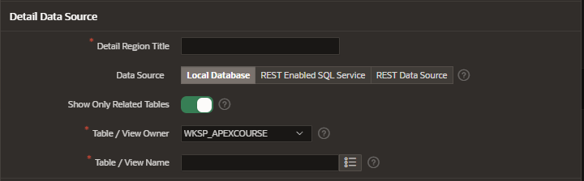
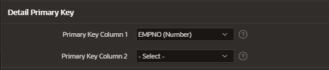
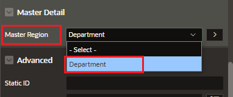
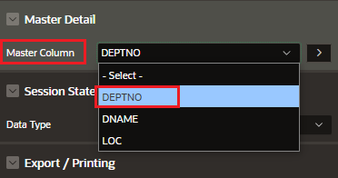

# Page Component Master Detail

## Using the Creation Page Wizard

Create a new page and choose the Master Detail component

### Choose the style

#### Stacked

A single page master-detail utilizing editable Interactive Grids

#### Side by Side

Consists of a report page master-detail utilizing side by side layout and report regions with modal edit windows

#### Drill Down

report page that drills down to a page where the selected master is standard form items, and the detail tables use editable Interactive Grids

Choose de data source for the master table and the primary key

Choose de data source for the detail table and the primery key

Set the columns of the relationship between the tables

## Without using the Creation Page Wizard

We need to set in the detail table the reference to the master table

And also, we need to set the relationship columns

