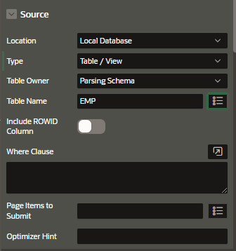

# Content Row

Content row is a classic report template that is suitable for displaying most types of content.

## Column Names

Use the columns names in the SQL query to customize the template of the content row.

Substituting these attributes with column names will customize the Classic Report into a content row type.

#### #ACTIONS#

Use this to display a button or other actions

#### #DESCRIPTION#

Description or text of the content

#### #ICON_CLASS#

Icon of the content row. Please prefix with "fa" when using Font Apex

#### #ICON_HTML#

Use this to display custom HTML in place of the icon.

For example, an image tag

#### #ITEM_CLASSES#

CSS Class-based modifiers for the content row item

#### #MISC#

This displays adjacent actions column and can be used for showing user information or last updated date

#### #SELECTION#

Use this to add a checkbox or radio button for selection

#### #TITLE#

Title column, typically the link

## Creation

Create a new page and select

Enter the page information

- Page Definition
- Navigation Preferences

## Edit Source

In the properties pane edit the source properties in Region tab.

## Edit Settings

In the Attributes tab edit the settings

## Edit Avatar

