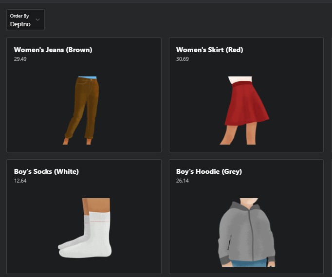
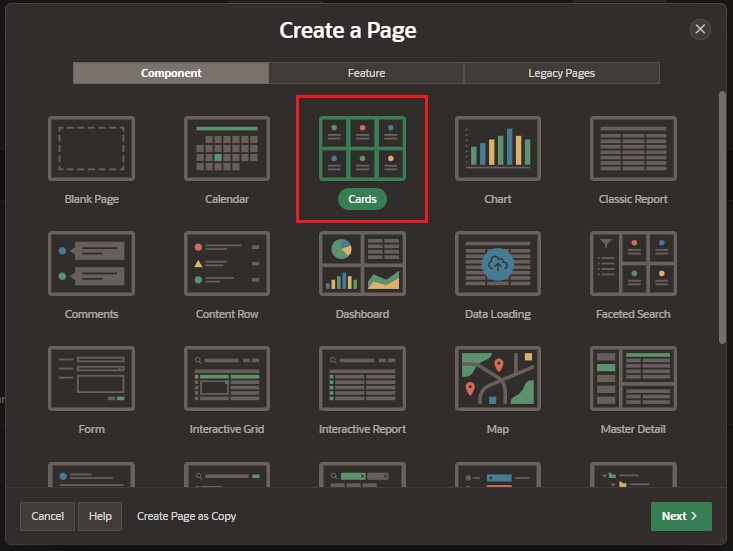
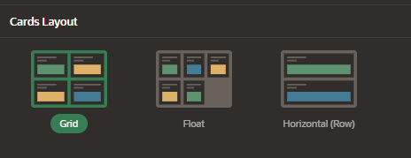
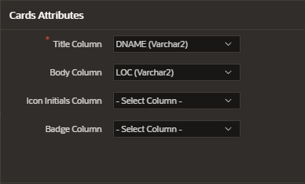
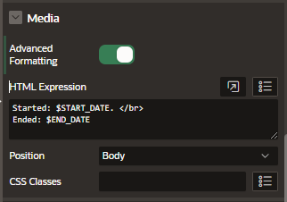
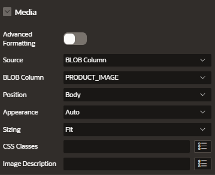
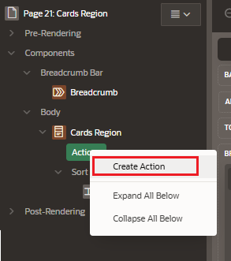

# Cards Region

A cards page features colorful blocks which resemble index cards laid out on a page.

A cards report region declaratively supports customizations of layout, and appearance, and the inclusion of icons, badges, media, and actions.

## Creation

Create Page, and Select Cards as component.

Under the name for the cards page, select the data source. I'm going to select a local database table called Projects.

Enter the page information

- Page Definition
- Data Source
- Navigation Preferences

Choose from a different cards layout

- Grid
- Float
- Horizontal (Row)

Set the card attributes that will be display

- Title column
- Body column
- Icon initials column
- Back column

## Attributes

### Card

- CSS Classes
- Primary Key

### Media

Advanced Formatting option allows to edit the format with:

- HTML Expressions
- CSS classes

## Customize Cards

### Cards with image

We can create display an image on the card by setting the source as "BLOB Column" and selecting the Blob column with the image

### Cards with links

Create an action under the cards regions

Configure the new action

- Set Identification > Type: Full Card
- Create the Link
  - Type
  - Target
