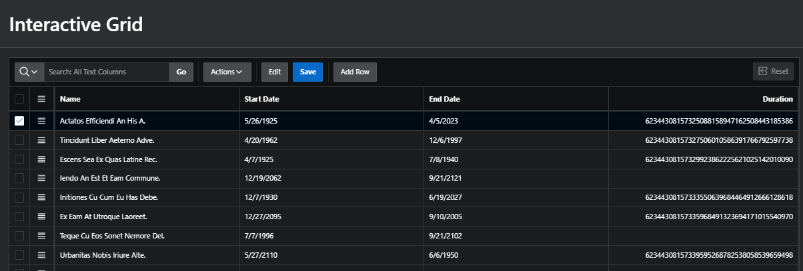
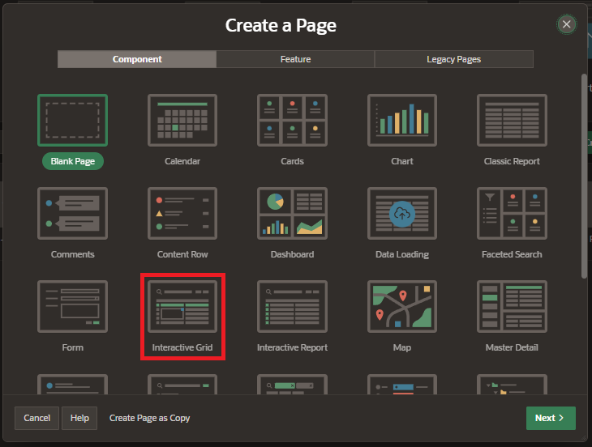
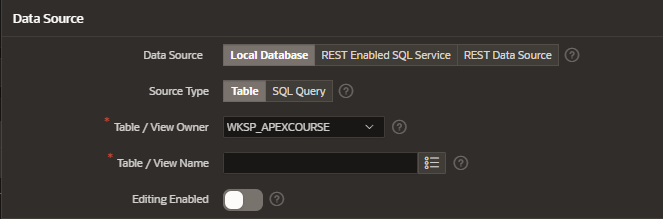

# Interactive Grid

An interactive grid presents users a set of data in a searchable customizable report.

## Functionalities

Interactive Grid includes most of the customization capabilities available in the interactive reports plus the ability to rearrange the report interactively using the mouse and keyboard.

## Creation

Create a new page and select the component Interactive Grid

### Page Definition

Enter the interactive grid details:

### Data Source

Enter the data source information

Data source:

- loca database
- REST enabled SQL Service
- REST data source

- Source Type:

  - Table
  - SQL statement

- Table / View Owner
- Table / View Name
- Editing Enabled: allows to edit data from the interactive grid

Select the primary keys columns

