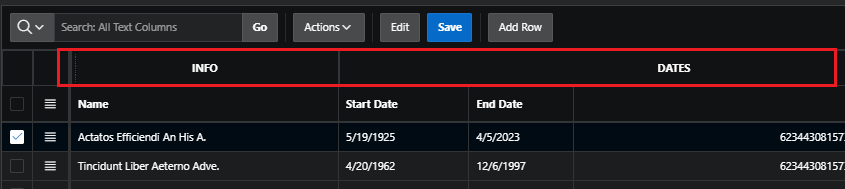
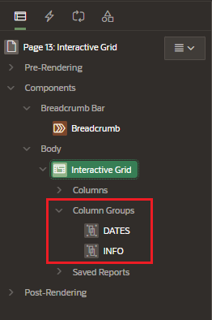
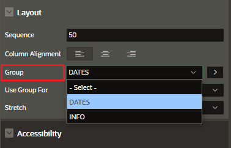

# Interactive Grid Render

## Group Columns

You can create groups for the headers of a column

First, create a column groups with the name you want to display

Assigned the columns that will be under de column group in the Column Properties

