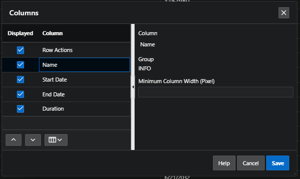

# Customising Intereactive Grid as a User

As a user, you can make lots of modifications in a interactive grids.

- actions menu
- column Head Menu

## Column

- Displayed: make columns visible or hidden
- Minimum Column Width (Pixel): specify minimum column width in pixels for each of these columns
- adjust order in which the columns appear using the buttons

## Filter

Under Actions menu is filter option using which you can filter the data in the report.

## Data

### Sort

Allow to create complex sorting configuration

### Aggregate

Option to aggregate by columns

### Compute

Create a computed column using functions and operations

### Flashback

In the Actions menu under Data submenu, there is an option called Flashback.

- indicate flashback duration in minutes
- click Apply
- report will be refreshed, showing the data that existed

## Format

### Break Control

You can create break control using one or more colums

### Highlights

You can highlights some records of the report You can specify the condition based on which this highlight will be applied.

## Charts

Allow to create chart and change the settings

# Head Column Menu

Clicking in a column head will show a menu of a set of features

- Control Break: to group by the selected column
- Aggregate: to define an aggregation against the selected column
- Freeze: puts the selected column outside the horizontal scrolling section
- Hide: to hide columns

## Rearranging and Resizing Columns

End users can also rearrange columns by using the drag and drop functionality in the Interactive Grid.
