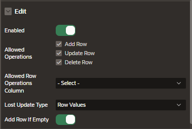

# Interactive Grid Settings

## Attributes

### Edit

- Enable: makes the grid editable
- Allowed operations:
  - add row
  - update row
  - delete row

### Pagination

The type of pagination can be:

- Scroll
- Page

### Enable User To

Enable user to a series of actions:

- Save Public Report: disable by default
- Save Public Report Authorization: available once you active "Save Public Reports"
  - Administracion Rights
  - Must not be public user
  - {Not Administration Rights}
- Flashback
- Define Chart View
- Download
