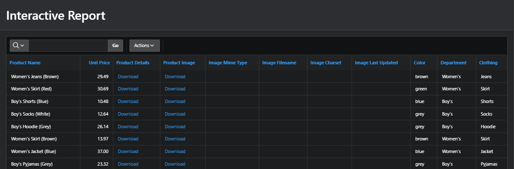
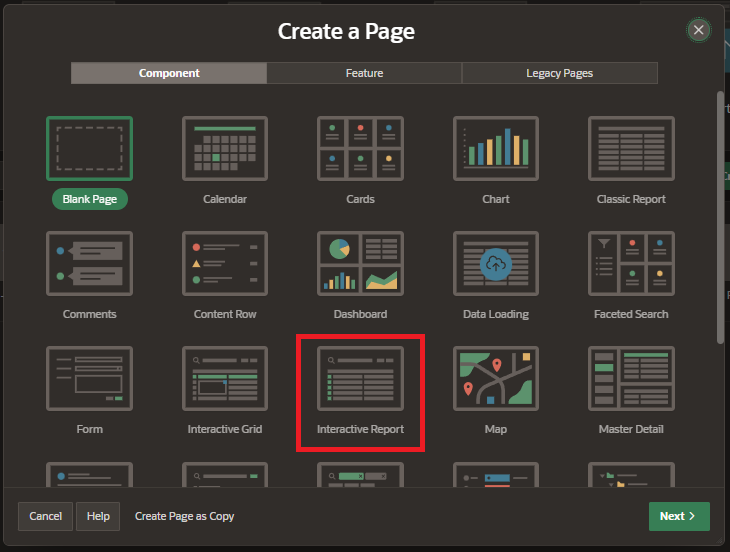
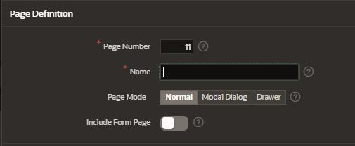
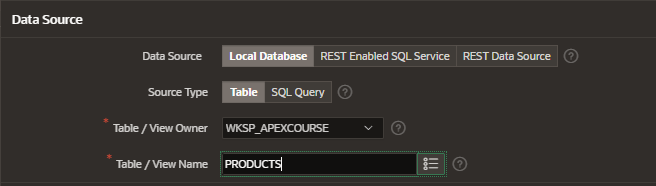
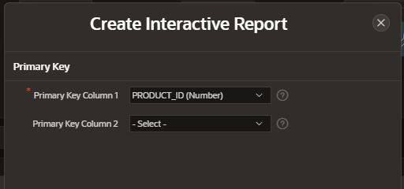

# Interactive Report

An interactive report is a formatted result of a SQL query.

## Functionalities

Interactive Reports allow the following functionalities:

- customize how and what data is displayed (hid, show)
- edit data using the form edit
- filter using the search bar
- custom sort
- column heading menus, and edit icons in the first column of each row.
- create
- group by, pivot
- save report
- download report

## Creation

Create a new page and select the component Interactive Report

### Page Definition

Enter the interactive report details

### Data Source

Enter the data source information

Data source:

- loca database
- REST enabled SQL Service
- REST data source

- Source Type:

  - Table
  - SQL statement

- Table / View Owner
- Table / View Name

Select the primary keys columns

