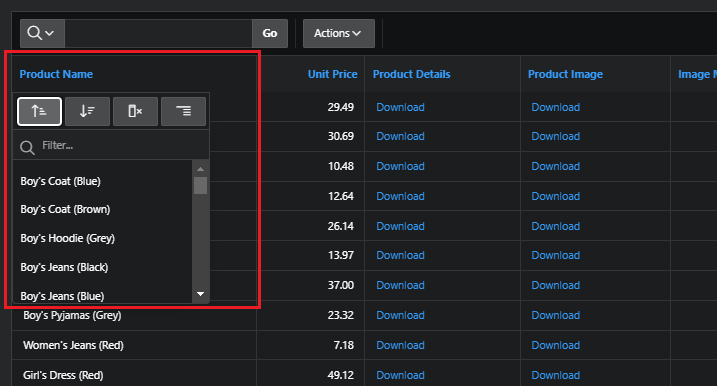

# Customising Intereactive Report as a User

As a user, you can make lots of modifications in a interactive reports.

- actions menu
- column Head Menu

# Actions

## Column

Configure the columns to display, or rearreange columns

## Filter

Under Actions menu is filter option using which you can filter the data in the report.

There are two options:

### Filter column

Filter based on a column

### Filter row

You can apply complex filtering conditions on an entire row.

For example, products with color 'blue' and unit price between 10 and 30

## Data

### Sort

Allow to create complex sorting configuration

### Aggregate

Option to aggregate by columns

### Refresh

Updates the interactive grid with the most current data available in the database.

### Flashback

In the Actions menu under Data submenu, there is an option called Flashback.

- indicate flashback duration in minutes
- click Apply
- report will be refreshed, showing the data that existed

## Format

### Break Control

You can create break control using one or more colums

### Highlights

You can highlights some records of the report You can specify the condition based on which this highlight will be applied.

## Charts

Allow to create chart and change the settings

## Report

### Save Report

Allow to save the report customized, you can save privately or public.

Once saved, it will appear con the selection list in the report.

### Reset

Remove any customization

## Download

Download the report in a range of file types

- csv
- html
- excel
- pdf

# Head Column Menu

Clicking in a column head will show a menu of a set of features

- Sort Ascending
- Sort Descending
- Hide Column
- Control break
