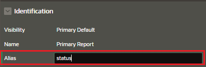

# Linking to Interactive Report

If you customize report and save them as and alternative report.

You can then link directly to a specific saved report using a request value in the URL.

```
IR[region static ID]_<saved report alias>
```

## Filtering

You can create filters using the itemName and itemsValues sintax

```
IR[region static ID]<operator>_<target column alias>
```

Operator list examples:

- C: contains
- EQ: equals
- GT: greater than
- etc

## Clearing

You can reset an interactive report and its pagination by passing the in the Clear Cache section of the URL one of the following values:

- RR: Reset Report
- RP: Reset Report pagination
- CR: Clear Report and pagination

# Create Link to Report

## Check Identification Information

Check the Interactive Report has the following identificacion information:

To be able to reference the Interactive Saved Report in another part of the application we need to check the report have the correct identification set.

### Interactive Report Static ID

In the Page Designer, if we go to the Region of the Interactive Report and check the we have an static ID


### Saved Report Alias

Also, in the Saved Report, check the alias is set, it is recommened to enter an identifier text instead of the default ID



## Link to the saved report

Create the link in the part of the application where you want to reference by selecting the option "Redirect to Page in this Application"


### Link Builder

Once you select the link option, you will need to configure the link builder

#### Target

Select the number of the page


#### Set Items

To link to a specific report using filters use the request syntax with itemName and itemValue

```
IR[projects]EQ_<target column alias>
```

- region static ID: reference to the interactive report
- target column alias: the filter will check this column value
- operator


#### Clear / Reset

You can reset an interactive report and its pagination by passing the value `RR` in the Clear Cache section of the URL.

- RR: Reset Report
- RP: Reset Report pagination
- CR: Clear Report and pagination

Choose to clear the regions so that all the previously applied filters are removed and the new filter is applied as and when you navigate to the report.


#### Advanced


