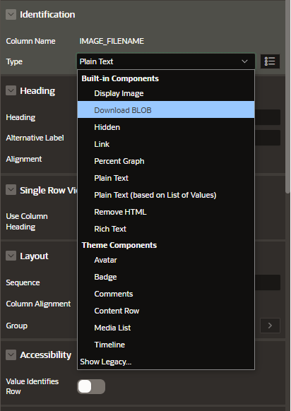
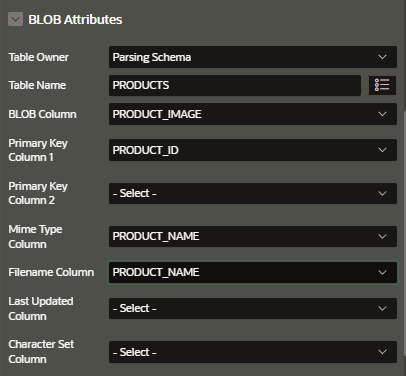
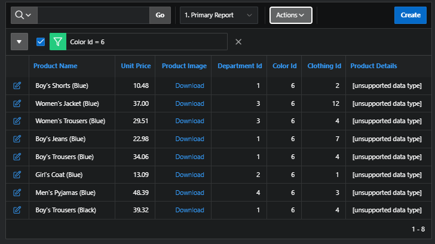
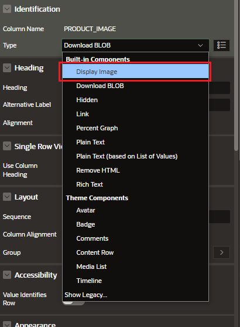
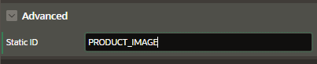
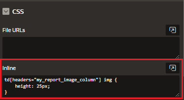

# Display Blob as download link

You can include a download link in an Interactive report to download a Blob columm.

## Add numeric/integer column expression on the query

Add a new numeric/integer column expression to your query, typically the size of the image file. If length is 0, the `BLOB` is `NULL` and no image is displayed

## Set Display Type as Blob

Set the Display Type of the colum as "Download Blob"

## Specify the Blob attributes

## Testing download

# Display Blob as Image

Change the Display Type as "Display Image"

You can customize the display attributes of these images using custom CSS.

- Set an STATIC ID for the `BLOB` column
  

- Go to inline CSS attribute in page level and write the custom CSS
  
