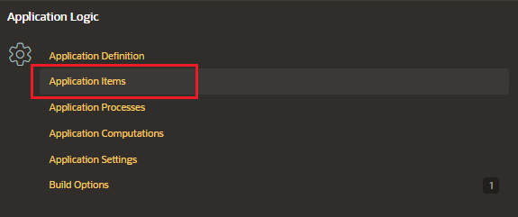

# Page Controls

In the Page Designer, in the project details form page there are different items listed under the items known. An item is part of an HTML form.

- text field
- text area
- password
- select list
- checkbox
- and so on

Item attributes affect the display of items on a page. For example, these attributes can impact where a label displays, how large an item is, and if the item displays next to or below the previous item.

There are two types of items.

- Page items
- Application items

# Application Items

Application level items do not display, but you can use an application item as a global variable to the application.

- can be set using computations, processes, or bypassing values on a URL
- to maintain a session state that is not displayed and is not specific to any page

## Access to Application Items

To access the application items page:

- navigate to the application home page and click on Shared Components

- go to Application logic > Application items

