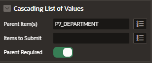

# List of Values

## Access to List of Values

To access the application items page:

- navigate to the application home page and click on Shared Components


- go to Other Components > List of Values


## Create List of Values

Click on button "Create" and the wizard will pop up


### Static Type

To create a static list select the type "Static"


Fill the static values for the list


### Dynamic Type

The dynamic list of values is based on the SQL query or the SQL query returned by a function body.

To create a dynamic list select the type "Dynamic"


Select the data source for the values of the list


Select the column mapping


## Associate List of Values to Page Item

You can associate with the page item type that can accept the list of values:

- select list
- shuttle
- check box
- radio group
- pop-up LOV
- list manager

### Set List of Values Attributes

In the List of Values Attributes select:

- Type: Shared Component
- List of Values: select your list of values created


And the result should be this


### Cascade List of Values

Create two item as Select List but on the seconde Select list include a reference to the first select list

```sql
select e.empno, e.ename from emp e where e.deptno = :P7_DEPARTMENT
```


Also, under Cascading List of Values, for parent items, select the first select list.

This indicates that the list of values for `P7_ENAME` is determined by the value selected in the `P7_department` number select list.


