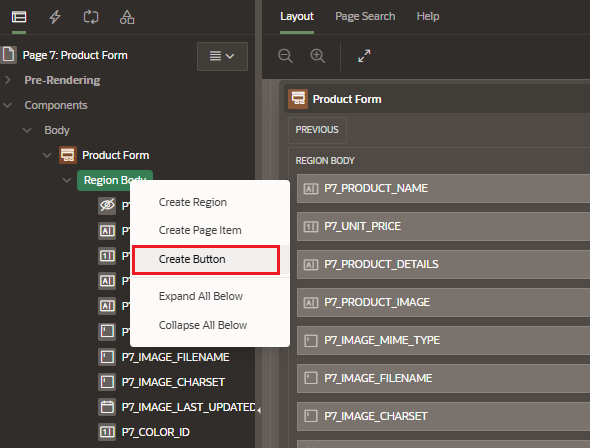
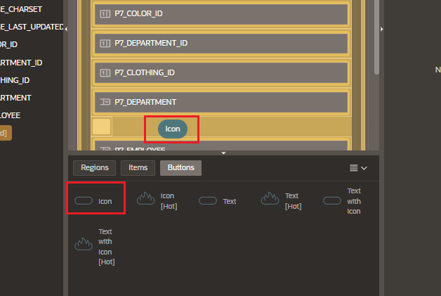

# Buttons

You can buttons to:

- submit a page
- redirect to a different page or a custom URL
- perform custom actions (Dynamic Action)

When you create reports and forms using wizards, you'll notice that some buttons, such as Cancel, Save, Create, and Delete, are automatically created.

## Creation

You can create a button in either of the following ways.

From Rendering Tab in the left pane

- go to Rendering tab > Page Designer
- go to the region node where you want to create the button
- right click and select "Create Button"

From the Gallery in the central pane

- go to the Layout tab > Gallery > Buttons
- passing the cursor over an button displays a tooltip that describes it
- select the button you want to create and drag it to the appropriate location in the layout

## Attributes

### Appearance

- Button template: define the appearance of the button

  - Icon
  - Text
  - Text with icon

- Hot button:
  - if selected, the button is rendered using the template stored in the Hot template attribute of a button template
  - if no value is defined, the regular button template is used. Here, I enable the Hot button template

### Behaviour

Under Behavior, select the action to be performed when the button is clicked:

- Submit Page:
  - submit the current page with the request value equal to the button name
- Redirect to Page in this Application:
  - redirects to a page in the current application
  - with optional additional attributes for resetting pagination, setting the request value, clearing cache, and setting item values on the target page
- Redirect to a Page in a Different:
  - redirects to a page in a different application
  - with optional additional attributes for resetting pagination, setting the request value, clearing cache, and setting item values on the target page
- Redirect to a URL
  - redirects to the target URL you specified
- Defined by Dynamic Action:
  - it does not submit the page or redirect to another page
  - behavior is defined by a dynamic action

### Server-Side Condition

Server-side conditions are those conditions that must be met in order for this button to be rendered a process.
