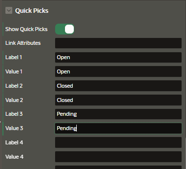
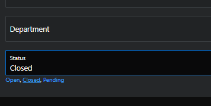

# Attributes

## Appearance

This property depends on the type of page items we are editing

- Template
- Template options
- CSS Classes
- Icon
- Format Mask
- Width/Heigth
- Value Placeholder

## Quick Picks

Quick picks enable users to select predefined values with just one click, rather than typing in text or selecting from a list of available options.

You can enter up to 10 quick picks for each page item.

Using the Quick Picks

