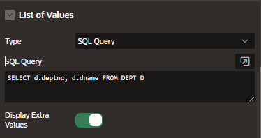
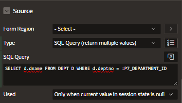
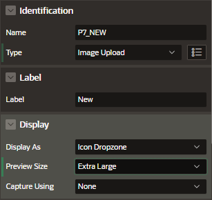

# Types

## Select Item

## Select One

Allows you to choose one value from the list of values.

It also allows you to search for the value and select them.

## Select Many

Allows you to select multiple values without closing the list of values dropdown.

- grouping and template directives
- searching for the value
- group the columns and search across multiple columns in the table

## Shuttle

- List of Values: select the data source
  

- Sorce: select the data source
  

  - Type: SQL Query (return multiple values)
  - SQL Query: enter the query

## Image Upload

Enable users to upload one or multiple images from a local file system or device. It provides a wizard, where images can be optionally cropped or resized.

The item type includes attributes specific to previewing, uploading, resizing, and cropping an image, which you can edit in the Property Editor.

### Attributes

#### Storage

Choose where to store the image

- Type:
  - Table APEX_APPLICATION_TEMP (Temporal Table)
  - Blob Column
- MIME Type Column
- Filename Column

#### Source

- Form Region: select the the column belongs
- Column: blob where the file will be stored
- Data Type

#### Resize To

You can resize the image before uploading specifing the maximum file size and also specify the width and height in pixels.

#### Cropping

There is algo the option to allow cropping.

## Combobox

A combo box page item displays a text item with a list of values icon.

Supports filtering and free input text.

If multiple value attributes is enabled, the combobox displays selected options as chips.

### Attributes

#### Settings

- Multi selection: allow more than one values
- Manual Entries Item: if Multi selection is enabled you need to also add a Page Item here
- Value HTML Expression: enter a layout for the combobox item

#### Multiple Values

If multi selection is enabled you should also define the multiple values type.

- Type:

  - No
  - Delimited list
  - JSON Array

- Separator

#### List of Values

Select the type of list you want for the combobox
