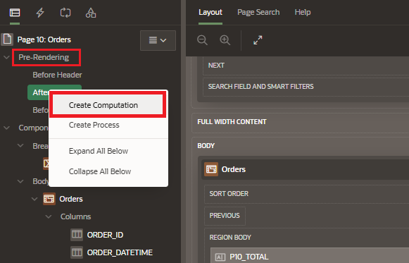
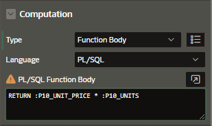
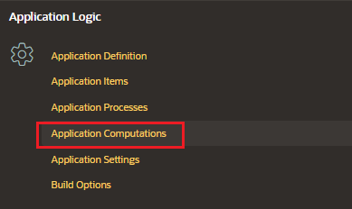

# Computations

A computation is a logic that can be used to assign values to a single item.

There are two types of computations:

- application-level:

  - defined at the application level
  - use
    - populate values into application items
    - assign values to different items.

- page-level:

  - defined at the page level
  - executed only for that specific page, when the page is loaded or submitted
  - use
    - populate values and do page items
    - ascend value to a specified item and the page is submitted or displayed

## Creation Page-level Computation

To create a page-level computation for an item:

- Go to properties pane > Pre-Rendering
- Under the execution point we want to create the computation (Before Header, After Header, Before Region)
  - right click and choose "Create Computation"



## Attributes

### Identification

Enter the page or application item populated by this computation.

### Execution

Computation can be executed at various execution points.

- Sequence: determines the order of execution
- Point: page rendering or processing where this computation is executed
  - New Session
  - Before Header
  - After Header
  - Before Region
  - After Region
  - Before Footer
  - After Footer
  - After Submit

### Computation



## Creation Application-level Computation

To access the Application Computations:

- navigate to the application home page and click on Shared Components



Click on "Create Computation"

Enter the configuration

- Item

  - Sequence
  - Computation item

- Frequency:

  - Computation Point
    - On New Instance (new session)
    - After Authentication
    - Before Header
    - After Header
    - Before Region(s)
    - After Region(s)
    - Before Footer
    - After Footer
    - After Submit

- Computation

  - Computation Type:
    - Expression
    - Function Body
    - Item Value
    - SQL Query (return single value)
    - SQL Query (return colon separated values)
    - Set Item Equal to Preference
    - Static Assignment
  - Computation: logic that corresponds to the computation type, for example:

    - QUERY computation:

    ```sql
    select to_char(sysdate,'YYYYMMDD') from dual
    ```

    - SQL_EXPRESION:

    ```sql
    to_char(sysdate,'YYYYMMDD')
    ```

    - STATIC_ASSIGNMENT:

    ```
    HELLO
    ```

    - PLSQL_EXPRESSION:

    ```SQL
    365 > v('DAYS_ELAPSED')
    ```
