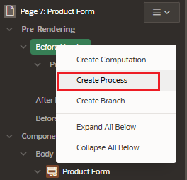

# Processes

## Page Process

Page process performs an action at a specified point during the rendering or submission of the page.

- runs when a specific event occurs
- exists different process points to control when the page process executes

## Application Processes

Application process are blocks of PL/SQL logic that are set to run at specific points using processes from multiple pages of an application.

## Create Process

To create a Process Page:

- Go to properties pane > Pre-Rendering
- Under the execution point we want to create the computation (Before Header, After Header, Before Region)
  - right click and choose "Create Process"

## Attributes

### Identification

Enter the page or application item populated by this computation.

- Name
- Type: process type (Default: Execute Code)
- Execution Chain
- Editable Region

## Source

- Location
- Language
- PL/SQL Code

### Execution

Processes can be executed at various execution points.

- Sequence: determines the order of execution
- Point: page rendering or processing where this computation is executed

  - New Session
  - Before Header
  - After Header
  - Before Region
  - After Region
  - Before Footer
  - After Footer
  - After Submit: Page Designer > Processes Tab > After Submit
  - Processing: Page Designer > Processes Tab > Processing
  - Ajax Callback: Page Designer > Processes Tab > Ajax Callback

- Run Process:
  - Once Per Page Visit (Default)
  - Once Per Session or When Reset

## Create Process Submit

Go to tab Processes in the Page Editor

Processing > Processes > rigth click and create "Create Process"
