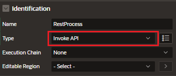

# Invoke API Process Type

Process to invoke a procedure or function stored in the local database, or an operation defined in a REST Data Source

- allows to run procedures and functions without writing PL_SQL Code

- Page Designer, auto-maps parameters to matching page items or Interactive grid columns

  - if parameters changes, you can use the Synchronized Parameters option to refresh the parameters

- fully PL/SQL data types aware, like number, date, and Boolean.

  - it can also handle more complex data types, such as PL/SQL records.

- output of parameters or functions can be stored in Page Items

## Invoke API Process Type for REST Data Source

The Invoke API process type supports not only packages, stored procedures, and functions but also REST data sources.

- allows you to make REST calls from page processes without writing any PL/SQL

- can map REST source parameters to page items, use SQL expressions, or set static values as needed

## Create Process

