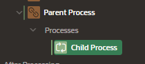

# Execution Chain

Background page processes use the execution chain process type, which can run tasks in either the foreground or background.

- contains one or more child processes executed sequentially
- useful for long running tasks, like data loading or complex data processing
- monitor processes using the APEX_BACKGROUND_PROCESS PL/SQL API
- job limits can be configured at the instance, workspace, or application levels

## Configuring Limits for Background Page Processing

Background page processing is actually executed by the database scheduler, `DBMS_SCHEDULER`.

This means that the application's parsing schema must have the CREATE JOB privilege granted in order to run background page processing jobs.

You can configure limits for concurrently running background page processing jobs at the following levels:

- instance level (default)
  - acts as a default for all workspaces and can be overridden at the workspace level.
- workspace level
  - acts as a maximm for all applications within that workspace
- application level
  - limit specific to this application
  - distribute the workspace limit across applications in that workspace

If a new background execution would exceed these configured limits, it will wait in a queued state until one of the running executions finishes and a slot becomes available.

## Monitor currently running background processes

Using the Runtime Developer toolbar, you can monitor the currently running background processes under the Session tab.

You can check their statuses and abort a currently running background process by clicking Abort.

## Example

Create a new process with type "Execution Chain"

If we want to execute it in the background:

Create the processes that will be executed in the Execution Chain.

- Exection Chain: Select the parent process

Once created, the child processes will be under the parent process

