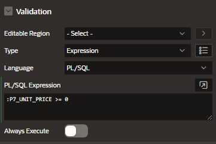
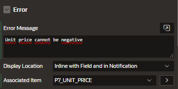

# Validations

You can create validations

- column level

## Create

For example, create a page item validaton of type Expression

Enter the custom message for if the validation didn't pass

- Error Message
- Display location
  - Inline with field and in Notification
  - Inline with field
  - Inline in Notification
  - On Error Page
- Associated Item: item that contains the validation

