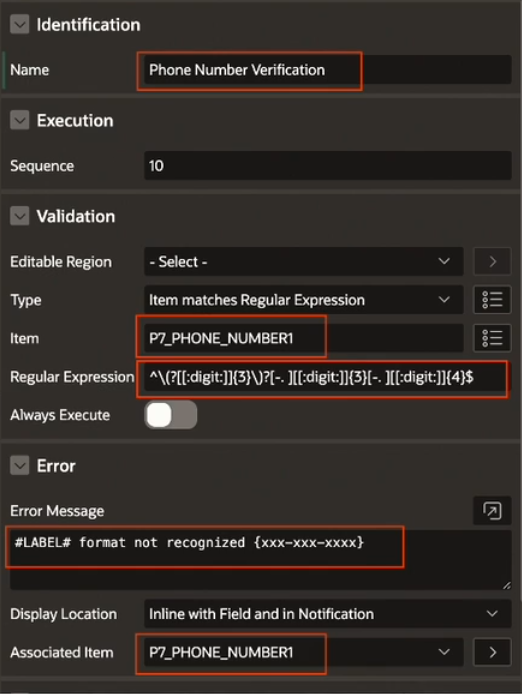

# Validations Types

## Rows returned

- Passes if the SQL query returns one or more rows
- Fails if the SQL query returns no rows

## No Rows returned

- Passes if the SQL query returns no rows
- Fails if the SQL query returns one or more rows

## Expression

- Passes if the expression evaluates to TRUE
- Fails if the expression evaluates to FALSE

## PL/SQL Error

- Passes if the PL/SQL code executes without generating an error
- Fails if the PL/SQL expression generates an error when it executes

## Function Body (returning Boolean)

- Passes if the Function body returns TRUE
- Fails if the Function body returns FALSE

Note: The result returned from the function must be a boolean.

## Function Body (returning Error Text)

- Passes if the Function body returns an empty string
- Fails if the Function body returns a non-empty string. The returned string displays as the error message for the validation

Note: The result returned from the function must be a text string.

## Item is NOT NULL

- Passes if the Item value is not empty
- Fails if the Item value is empty

## Item is NOT NULL or zero

- Passes if the Item value is not empty and is not the number zero
- Fails if the Item value is empty or is the number zero

## Item is NOT zero

- Passes if the Item value is not the number zero
- Fails if the Item value is the number zero

## Item contains no spaces

- Passes if the Item value has no spaces
- Fails if the Item value contains spaces

## Item is alphanumeric

- Passes if the Item value is alphanumeric, containing only letters and numbers and no special characters
- Fails if the Item value includes special characters

## Item is numeric

- Passes if the Item value is numeric
- Fails if the Item value contains non-numeric characters, including spaces, other than leading spaces

## Item is a valid date

- Passes if the Item value is a valid date
- Fails if the Item value is not a valid date

## Item is a valid timestamp

- Passes if the Item value is a valid timestamp
- Fails if the Item value is not a valid timestamp

## Item = Value

- Passes if the Item value is equal to the text you enter into the Value attribute
- Fails if the Item value is not equal to the text you enter into the Value attribute

## Item != Value

- Passes if the Item value is not equal to the text you enter into the Value attribute
- Fails if the Item value is equal to the text you enter into the Value attribute

## Item is contained in Value

- Passes if the Item value is completely contained in the text you enter into the Value attribute
- Fails if the Item value is not completely contained in the text you enter into the Value attribute

## Item is NOT contained in Value

- Passes if the Item value is not completely contained in the text you enter into the Value attribute
- Fails if the Item value is completely contained in the text you enter into the Value attribute

## Item contains only characters specified in Value

- Passes if the Item value contains only characters found in the text you enter into the Value attribute
- Fails if the Item value contains any characters that are not in the text you enter into the Value attribute

## Item contains at least one of the characters in Value

- Passes if the Item value includes at least one character from the text you enter into the Value attribute
- Fails if the Item value does not include any characters from the text you enter into the Value attribute

## Item does NOT contain any of the characters in Value

- Passes if the Item value does not include any characters from the text you enter into the Value attribute
- Fails if the Item value includes at least one character from the text you enter into the Value attribute

## Item matches Regular Expression

- Passes if the Item value matches the regular expression you enter into the Value attribute
- Fails if the Item value does not match the regular expression you enter into the Value attribute

Note: Regular expressions enable you to search for patterns in string data by using standardized syntax conventions, rather than just a straight character comparisons.

