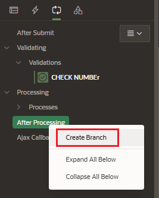
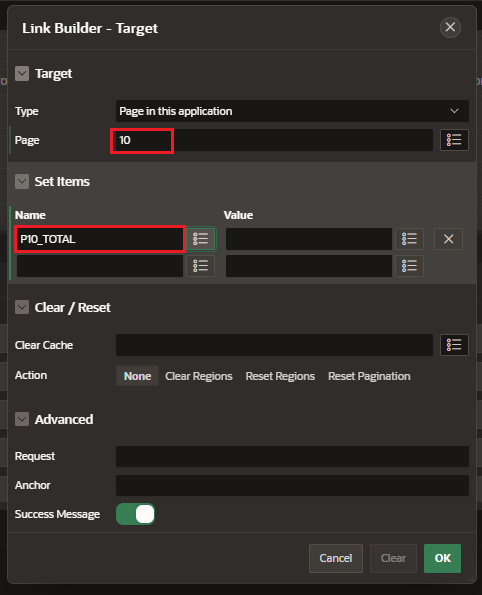

# Branches

A branch is an instruction to navigate to a specific page or URL when the page is submitted or the page is rendered.

We can also open modal dialogues and non-modal dialogue pages using branches.

## Create

Click on Behaviour > Target to configure the target link of the branch

- Target

  - Type:

    - Page in this application
    - Page in other application
    - URL

  - Page: select page to navigate to

