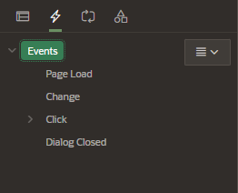
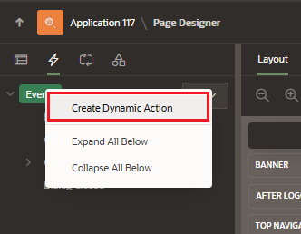
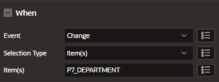
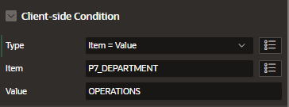
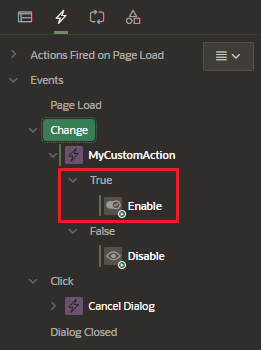
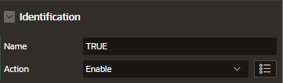
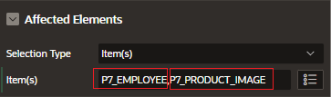
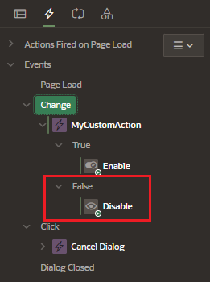

# Dynamic Actions

Dynamic Actions provide a way to define complex client-side behavior declaratively without the need for JavaScript.

Using the Create Dynamic Action wizard to:

- specify an action that is performed when a defined set of conditions occur
- specify which elements are affected by the action and when and how they are affected

## Cost of Dynamic Actions on the client

When working with dynamic actions, you should be mindful of the fact that the more Dynamic Actions you add to a page, the greater your overall page size.

This is because the Dynamic Action framework can make additional code to the client for each Dynamic Action defined, which then also must be downloaded and executed by the framework in the client.

## Dynamic Action events

When you create a Dynamic Action, you specify the event that causes the Dynamic Action to fire.

Events are categorized into the following types:

- Browser events: Standard browser events

  - change, click, double-click, click OK, and so on

- Framework events: triggered from within the APEX framework

  - after refresh, before page submit, and so on

- Component events: only available when there is a component (item, region, or dynamic action)available to your application that triggers a custom event
  - triggered from either native components or plugin components that you have installed in your application
- Custom event: triggered from your application

# Create Dymanic Action

Creating Dynamic Actions involves specifying:

- when the action happens (with optional conditions)
- what action or actions are perform
- what elements are affected by the action

View the page in Page Designer and go to the Dynamic Actions tab (left pane)

Right click on Events and select "Create Dynamic Action"

## Attributes - Dynamic Action

In property Editor, edit the following attributes

### Identification

Enter name of the action

### When

- Event: that causes the dynamic action to fire
- Selection Type: element to be used to trigger the event
- Items: items to trigger the dynamic action

For example, this Dynamic Action will be trigger when the item P7_DEPARTMENT value is changed

### Client-side condition

Specify a client-side condition to control whether True or False actions fire.

- Type: condition to evaluate
- Item: page element to be used to trigger the event
- Value: used for this condition

For example, this Dynamic Action will be trigger if the new item value of P7_DEPARTMENT is 'OPERATIONS'

## Attributes - TRUE Action

In case the conditions evaluated in the Dynamic Action are TRUE, the action TRUE will be executed

### Identification

- Name
- Action: Disable, enable, show, etc

### Affected Elements

- Selection Type: define the page components to be affected when this action is executed
- Items: page items to be affected by this action

## Attributes - FALSE Action

In case the conditions evaluated in the Dynamic Action are FALSE, we can also define what the action FALSE will executed

# Debugging Dynamic Actions

Debugging Dynamic Actions in Oracle APEX is slightly different than other debugging because much of the processing done with the Dynamic Action framework is done on the client, not on the server.

To debug Dynamic Actions, Oracle APEX outputs debug information to the browser's JavaScript console if your browser supports it.

To debug a Dynamic Action:

- ensure that the application containing the Dynamic Action has Debugging enabled
- run the page containing the Dynamic Action
- open the browser's JavaScript console
- from the Developer toolbar, click Debug
