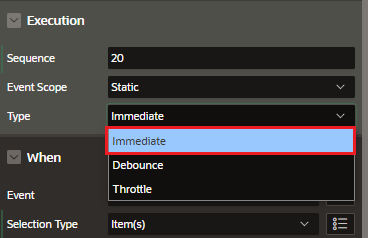
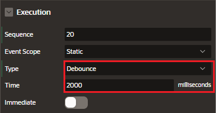
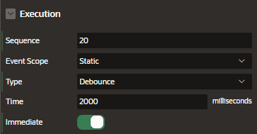
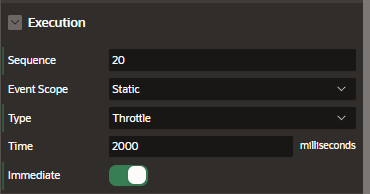
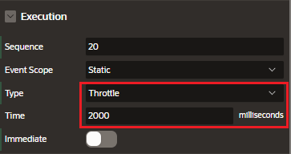

# Debounce and Throttle

The debouncing and throttling are techniques to reduce repeated and unnecessary calls by setting the Dynamic Action Execution:

- type
- time
- immediate properties

# Debounce

Exectue an action with a delay to execute it once after a specified time delay from the last time an event fires

- update a text field if the user has stopped typing for 2 seconds and use the values last entered
- refresh a region once after a click and ignore all other clicks in the next 5 seconds

# Throttle

Execute an action immediately and then in timed intervals if the event continues to fire

- during scrolling, update the current screen position at least every 2 seconds

  - the action will continue to fire if the user keeps scrolling

- as a user types, update a text field with the values entered at least every 2 seconds
  - the action will continue to fire as the user keeps typing

# Examples

### Immediate

The Dynamic Action will execute immediately.

Each time a key is released, the item will be updated to have the same value as the text area

### Debounce Delay

The Dynamic Action will execute 2000ms after the key release event was triggered.

If the event is triggered multiple times before the delay is over, the timer resets each time and the action will execute after the last event.

### Debounce Immediate

The Dynamic Action will execute immediately after the first key release event before starting the timer for 2000ms.

If the event is triggered before the delay is over, the timer resets each time and all events are ignored until the delay is over.

### Throttle Delay

The Dynamic Action will execute 2000ms after the first key release event.

If the event is triggered multiple times before the delay is over, the last triggered event will be executed at the end of the initial delay.

### Throttle Immediate

The Dynamic Action will execute immediately after the first key release and then the 2000ms delay begins.

If the event is triggered during the delay, the last triggered event will be executed after the initial delay and another delay begins.

